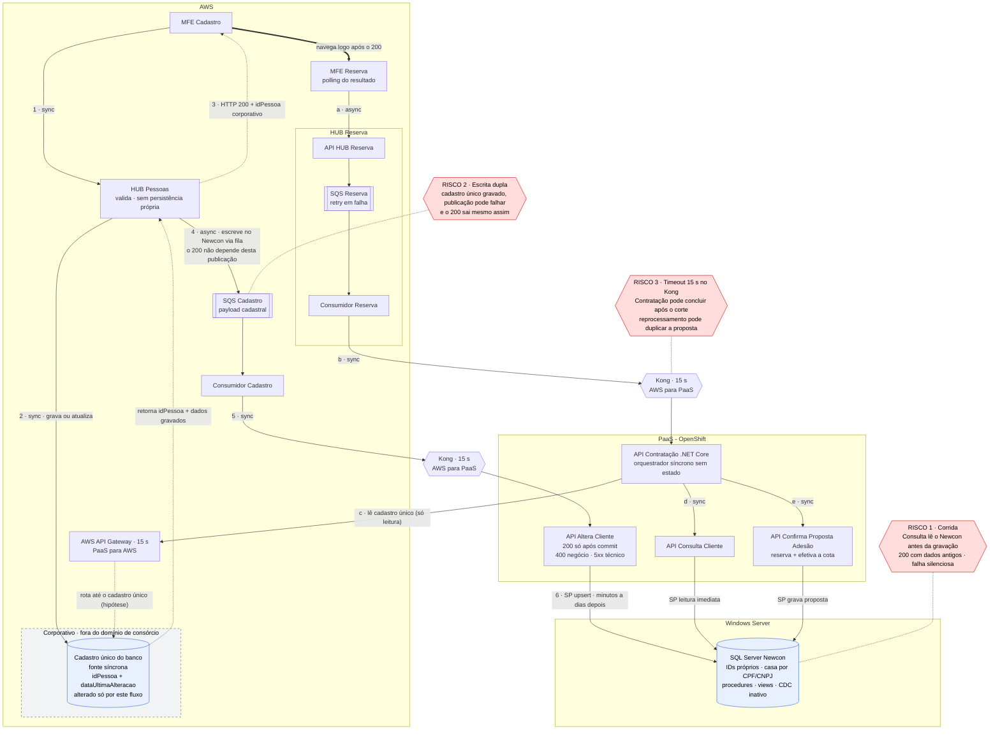
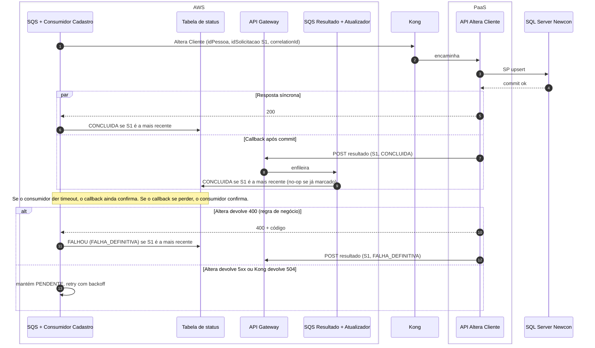
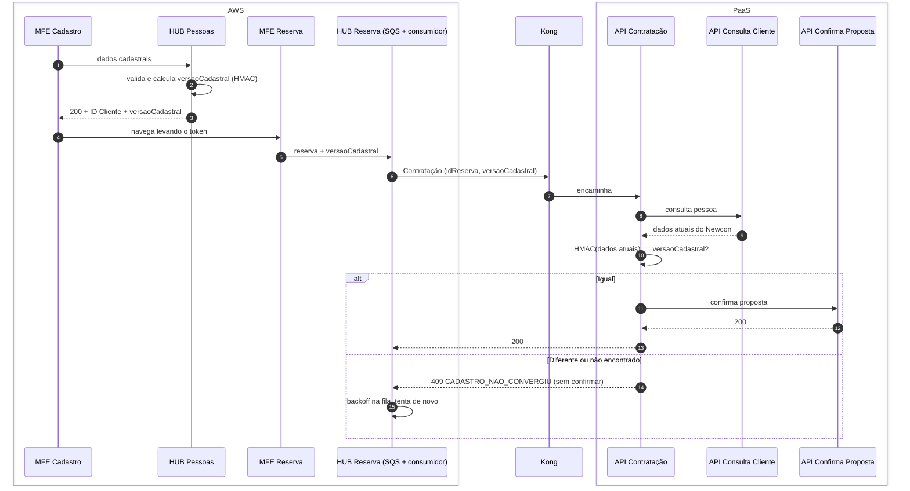
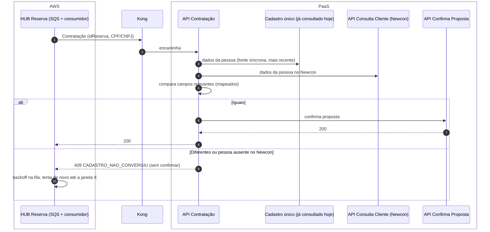
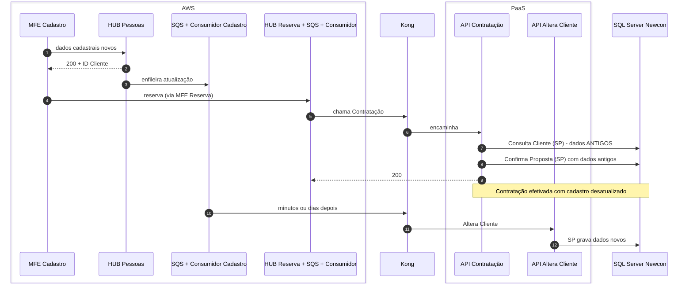
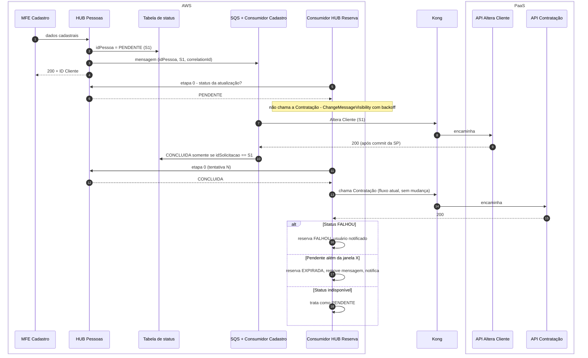
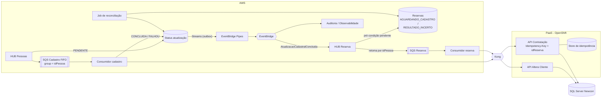
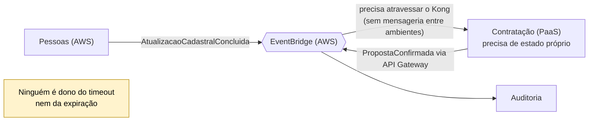
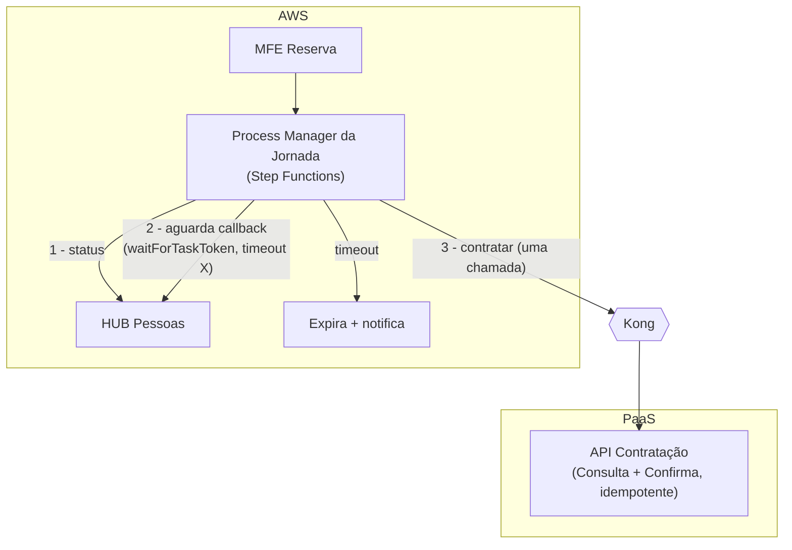
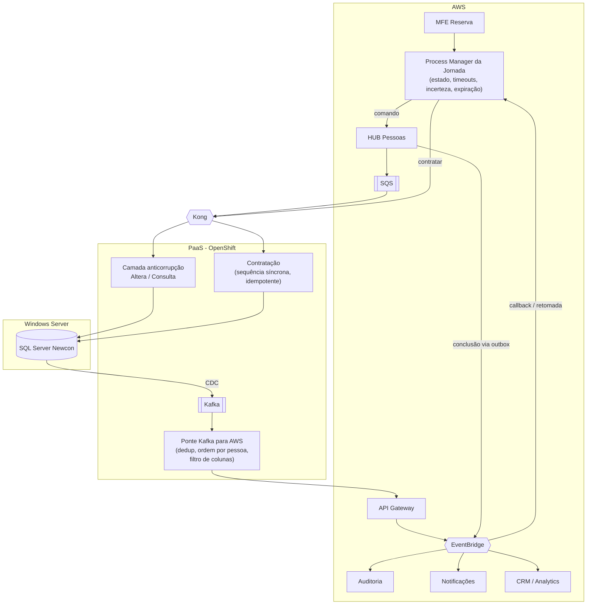

# Jornada de Consórcio — Consistência Temporal entre Cadastro de Pessoa e Contratação

> Análise arquitetural (Fases 3 a 5), feita depois da validação da interpretação da arquitetura atual.
> **Revisão 2:** incorpora a topologia AWS / PaaS (OpenShift) / SQL Server Newcon, a comunicação via Kong e API Gateway e a disponibilidade de CDC.
> **Revisão 3:** avalia o callback da API Altera Cliente para a AWS (seção 6.4).
> **Revisão 16:** o HUB publica hoje o payload original do MFE; recomendado publicar os dados retornados pelo cadastro único (6.9 e 6.7).
> **Revisão 15:** o cadastro único retorna `idPessoa` + dados gravados; papéis de leitura e escrita explicitados (2.3); diagrama ajustado; igualdade por construção na 6.9.
> **Revisão 14:** o cadastro único não tem conexão com o Newcon e não deve guardar estado de sincronização; o HUB Pessoas é o único integrador. Opção b da 6.13 descartada; princípio de fronteira registrado.
> **Revisão 13:** o cadastro único está na AWS e é uma peça corporativa, fora do domínio de consórcio. Diagrama 2.4 / 15.1 ajustado; a leitura da Contratação passa a ser representada via API Gateway.
> **Revisão 12:** diagrama consolidado da arquitetura atual (seções 2.4 e 15.1).
> **Revisão 11:** avaliação do callback da Altera (6.4) como substituto da tabela de status (6.13).
> **Revisão 10:** 6.9 validada (as leituras acontecem antes da Confirma; o cadastro único e o Newcon gravam os campos como recebem). Plano de ação por time (6.7) reescrito para a 6.9.
> **Revisão 9:** a Contratação já consulta o cadastro único (fonte síncrona, sem outros canais), o que permite verificar a convergência cadastro único × Newcon **sem token e sem banco** (6.9). O HUB responde 200 sem garantir a publicação: escrita dupla confirmada (6.10). Novas seções 6.11 e 6.12.
> **Revisão 8:** incorpora o cadastro único corporativo (gravação síncrona, `idPessoa` corporativo) e as respostas sobre o token de versão (a Consulta devolve os campos como enviados; a Contratação deve aceitar a mudança).
> **Revisão 7:** alternativa de curtíssimo prazo sem banco de dados: token de versão cadastral (seção 6.8).
> **Revisão 6:** timeouts de 15 s confirmados no Kong e no API Gateway; responsáveis pelo HUB Pessoas e pelo HUB Reserva definidos; plano de ação por time (seção 6.7).
> **Revisão 5:** incorpora a classificação de retornos da Altera Cliente (400 = negócio, 5xx = técnico) e confirma a viabilidade do callback (seção 6.4).
> **Revisão 4:** incorpora os timeouts informados (15 s), a confirmação de que a Altera Cliente responde após o commit e a divisão de responsabilidades entre times (seções 6.5 e 6.6).
> Convenção usada no documento: **[FATO]** foi confirmado por você; **[HIPÓTESE]** ainda precisa ser validada; **[DECISÃO DE NEGÓCIO]** não é técnica e precisa de um dono.

---

## 1. Resumo executivo

**O problema.** A jornada usa o HTTP 200 do HUB Pessoas como sinal de que a pessoa está atualizada. Esse 200 só significa que a solicitação foi aceita e validada. A gravação no Newcon (SQL Server) acontece depois, de forma assíncrona: vai da AWS, atravessa o Kong e o PaaS, e leva de ~10 minutos a dias. A lentidão e a indisponibilidade estão tanto no SQL Server quanto na própria fila do HUB Pessoas **[FATO]**. Enquanto isso, a API Contratação consulta o Newcon, recebe **200 com os dados antigos** e confirma a proposta com eles. Nenhum componente percebe a diferença.

**A causa raiz.** Não existe, em lugar nenhum, um **estado persistido da solicitação de atualização cadastral**. Ninguém consegue responder "a pessoa X tem uma atualização pendente?".

**O que a topologia muda.** Toda comunicação entre a AWS e o PaaS é HTTP via gateway: Kong na direção AWS → PaaS e API Gateway na direção PaaS → AWS **[FATO]**. As alterações no Newcon dependem de solicitação ao fornecedor **[FATO]**. Por isso, a recomendação prioriza soluções que:
- (a) ficam **inteiramente na AWS** no curtíssimo e no curto prazo;
- (b) **não criam novas travessias síncronas** de fronteira;
- (c) disparam **já** as solicitações ao fornecedor, que têm prazo longo.

**Recomendação por horizonte:**

| Horizonte | Mudança central | Onde | Esforço |
|---|---|---|---|
| Curtíssimo prazo, com banco (6.2; descartada pela restrição de banco) | O HUB Pessoas registra o **status da atualização** por `idPessoa`. O **consumidor do HUB Reserva** verifica o status **antes** de chamar a API Contratação: se pendente, a mensagem volta para a fila com backoff. | **Só AWS**. A Contratação não muda. | Baixo a médio |
| **Curtíssimo prazo, sem banco (recomendado)** (6.9) | A **Contratação compara** os dados do **cadastro único** (que já consulta) com os do **Newcon** (Consulta Cliente) antes da Confirma. Se divergirem, devolve erro retentável e o HUB Reserva faz backoff. O **HUB Pessoas publica na SQS antes do 200** (6.10). | PaaS (Contratação) + ajustes AWS, **sem persistência nova** | Baixo |
| Alternativa sem banco (6.8) | Token de versão cadastral (HMAC) trafegando pela jornada. Plano B se a comparação entre os modelos for inviável. | AWS + PaaS + MFEs | Baixo a médio |
| **Em paralelo, já** | Pedir ao fornecedor: CDC na tabela de pessoa, coluna de última alteração e detecção de proposta duplicada. Tratar a ambiguidade de timeout entre o HUB Reserva e a Contratação. | Fornecedor + PaaS | Depende do fornecedor |
| **Curto prazo** | **Callback da Altera Cliente** (PaaS → API Gateway) como segunda fonte de conclusão; `AtualizacaoCadastralConcluida` no EventBridge; reserva **estacionada** e **retomada** pelo evento; reconciliação; idempotência na Contratação. | AWS + PaaS | Médio |
| **Médio prazo** | **Process Manager da jornada na AWS** (Step Functions) como dono da espera, do timeout e da expiração. A Contratação continua no PaaS como executora síncrona, chamada **uma vez** quando tudo está pronto. **CDC → Kafka → ponte → AWS** como confirmação vinda da fonte de verdade. | AWS + ponte PaaS → AWS | Médio a alto |
| **Longo prazo** | Domínios separados, **Saga orquestrada** no núcleo, **coreografia** na periferia, camada anticorrupção sobre o Newcon e **ponte de eventos PaaS ↔ AWS como capacidade de plataforma**. | Ambos | Alto, incremental |

**A resposta à pergunta central (seção 14.1):** Pessoas publica o **fato** `AtualizacaoCadastralConcluida`. A Jornada **deriva** o estado `PRONTA_PARA_CONTRATACAO`. Nem o HTTP 200 nem um evento `PessoaProntaParaContratacao` emitido por Pessoas devem autorizar a contratação.

**Riscos que merecem atenção independentemente da solução:**
1. **Duplicidade por timeout na fronteira.** O consumidor do HUB Reserva chama a Contratação via Kong. O Kong corta em **15 s** **[FATO]**. Se a Contratação ainda estiver executando nesse momento (ela não tem orçamento interno conhecido), a mensagem é reprocessada e pode gerar **uma segunda proposta**. Se o visibility timeout da fila de reserva (não informado) não tiver folga, a mesma reserva pode ser **processada em paralelo, sem erro aparente**. Veja a seção 6.5.
2. A configuração das filas é desconhecida **[FATO]**: `maxReceiveCount`, retenção e DLQ podem perder reservas em indisponibilidades de dias.
3. Nada reserva a cota antes da confirmação **[FATO]**. Quanto mais longa a espera, maior o risco de indisponibilidade da cota. **[DECISÃO DE NEGÓCIO]**
4. Duas atualizações seguidas da mesma pessoa numa fila Standard podem ser aplicadas fora de ordem.
5. Mudanças no Newcon passam pelo fornecedor **[FATO]**, então qualquer solução que dependa delas tem prazo externo e não pode ser o hotfix.
6. **Escrita dupla cadastro único → SQS, confirmada** **[FATO]**: o HUB responde 200 mesmo sem publicar. Se a publicação falhar, o Newcon nunca é atualizado. A comparação da 6.9 **impede a contratação errada**; a correção (publicar antes do 200) e o reparo por leitura estão na 6.10.

---

## 2. Arquitetura atual (consolidada após a validação)

### 2.1 Topologia e fronteiras **[FATO]**

| Ambiente | Componentes |
|---|---|
| **AWS** | MFE Cadastro, MFE Reserva, HUB Pessoas, HUB Reserva, SQS Cadastro, SQS Reserva e os **consumidores das duas filas** |
| **PaaS (OpenShift)** | API Contratação, API Consulta Cliente, API Altera Cliente, API Confirma Proposta Adesão |
| **Windows Server** | **DB Newcon (SQL Server)**: expõe procedures, views e CDC. Mudanças são solicitadas ao fornecedor. CDC ainda não está ativo na tabela de pessoa, mas consegue alimentar um tópico Kafka. |

| Direção | Caminho |
|---|---|
| AWS → PaaS | **Kong** (gateway on-premises) |
| PaaS → AWS | **AWS API Gateway** |
| Mensageria entre ambientes | **Não existe**. Tudo é HTTP pelos gateways. |

**Travessias AWS → PaaS no fluxo atual:**
- consumidor do cadastro → Kong → API Altera Cliente;
- consumidor do HUB Reserva → Kong → API Contratação.

### 2.2 Fluxos

**Fluxo A — Cadastro**
1. O MFE Cadastro chama o HUB Pessoas (AWS) de forma síncrona. Ele valida e responde **200 + ID Cliente**, sem persistir nada.
2. O HUB publica na SQS do cadastro. O consumidor (AWS) chama, **via Kong**, a API Altera Cliente (PaaS), que grava no SQL Server via stored procedure.
3. O tempo vai de ~10 minutos a dias. As causas estão na **fila do HUB Pessoas** e no **SQL Server**.

**Transição:** assim que recebe o 200, o MFE Cadastro navega para o MFE Reserva.

**Fluxo B — Reserva/Contratação**
1. O MFE Reserva chama o HUB Reserva (AWS), que enfileira e consome da própria SQS. O MFE acompanha por **polling**.
2. O consumidor do HUB Reserva (AWS) chama, **via Kong**, a API Contratação (PaaS). **É o único chamador da Contratação.** **[FATO]**
3. A Contratação orquestra no PaaS: **Consulta Cliente (200)**, depois **Confirma Proposta Adesão (200)**, que reserva e efetiva a cota.
4. Consulta, Altera e Confirma acessam o Newcon via stored procedure. O Newcon é o sistema de registro da pessoa, da simulação e da proposta/cota.
5. Em caso de falha, a mensagem da reserva volta para a fila e é reprocessada.

**Identificadores disponíveis:** só o `idPessoa` / ID Cliente.

### 2.3 Cadastro único corporativo **[FATO]**

- Antes de enfileirar a atualização do Newcon, o HUB Pessoas grava **de forma síncrona** no **cadastro único do banco** (base corporativa).
- O `idPessoa` devolvido no 200 é o **identificador corporativo**, não o do Newcon.
- A gravação no Newcon continua **assíncrona**, pelo fluxo descrito acima.
- **Premissa:** a reserva (HUB Reserva, Contratação, Consulta e Confirma) **precisa** usar o Newcon.

**Consequência para o enquadramento.** O 200 do HUB atesta um fato verdadeiro: "o cadastro único foi atualizado". Do ponto de vista da reserva, porém, o Newcon funciona como uma **réplica assíncrona** do cadastro único. Isso corrige a hipótese H3: a leitura é feita na fonte **do Newcon**, mas o Newcon está **atrasado em relação ao cadastro único**. A condição que deve liberar a contratação é "**o Newcon está sincronizado com a versão que o cliente enviou**".

**Confirmado depois** **[FATO]**:
- o Newcon tem **identificadores próprios** e casa a pessoa pelo **CPF/CNPJ**;
- o cadastro único devolve o `idPessoa` com a **data de última alteração** e **não publica eventos**;
- o HUB responde **200 mesmo sem publicar na SQS**;
- o cadastro único **não é alterado por outros canais**;
- o cadastro único é **consultável a partir do PaaS**, e a **API Contratação já o consulta**;
- o cadastro único **fica na AWS**, mas é uma **peça corporativa**, fora do domínio dos times de consórcio. Mudanças nele dependem do time corporativo dono da base.
- o cadastro único **não tem nenhuma conexão com o Newcon**, não é capaz e **não deve** guardar informação sobre ele (ex.: data de sincronização). **Só o HUB Pessoas**, do domínio de consórcio, integra os dois: cadastro único e Newcon.
- ao gravar ou atualizar, o cadastro único **retorna o `idPessoa` e os dados gravados** ao HUB Pessoas;
- **papéis de leitura e escrita:**

  | Componente | Cadastro único | Newcon |
  |---|---|---|
  | HUB Pessoas | **Grava** (síncrono) | **Escreve** (assíncrono, via fila → Altera Cliente) |
  | API Contratação | **Lê** | **Lê** (Consulta Cliente) e grava a proposta (Confirma) |

### 2.4 Diagrama da arquitetura atual (consolidado)



**Legenda:**
- **1 a 6:** Fluxo A (cadastro).
- **a a e:** Fluxo B (reserva e contratação).
- Linha **dupla**: navegação entre MFEs.
- Linha **tracejada**: resposta ou relação.
- Em **vermelho**: riscos confirmados.

O **cadastro único está na AWS**, mas é uma **peça corporativa**, fora do domínio dos times de consórcio **[FATO]**. O HUB Pessoas grava nele dentro da AWS. A Contratação o lê a partir do PaaS: como toda comunicação PaaS → AWS passa pelo API Gateway **[FATO]**, o diagrama mostra essa rota. **[HIPÓTESE: confirmar se essa leitura passa pelo mesmo API Gateway, com o limite de 15 s]**


---

## 3. Confirmação dos problemas

| # | Problema | Evidência |
|---|---|---|
| P1 | O HTTP 200 do HUB é interpretado como "pessoa atualizada", mas significa "solicitação aceita". | Confirmado |
| P2 | Para cliente **existente**, a Consulta Cliente devolve 200 com dados antigos e a contratação segue **silenciosamente**. **Esta é a dor principal.** | Confirmado |
| P3 | Para cliente **novo**, a consulta não encontra a pessoa e a contratação falha. A reserva é reprocessada, sem garantia de convergência. | Confirmado |
| P4 | Não há estado persistido nem consultável da atualização cadastral. | Confirmado (o HUB não persiste) |
| P5 | Não há identificador que ligue a solicitação cadastral à reserva. | Confirmado (só o idPessoa) |
| P6 | O comportamento de retry, DLQ e retenção das filas é desconhecido. | Confirmado (desconhecido) |
| P7 | Há risco de duplicidade na confirmação da proposta quando a reserva é reprocessada. | **[HIPÓTESE]**: depende de a SP de confirmação detectar duplicidade |
| P8 | Há risco de atualizações da mesma pessoa serem aplicadas fora de ordem. | **[HIPÓTESE]**: depende do tipo de fila (Standard ou FIFO) |
| P9 | Timeout na chamada AWS → Kong → Contratação pode gerar reexecução enquanto a primeira ainda confirma. | **[HIPÓTESE]**: depende da hierarquia de timeouts |

**Por que P2 é mais grave que P3:** P3 falha de forma **ruidosa** (erro, retry, log). P2 é uma falha **silenciosa**: gera uma proposta válida do ponto de vista técnico, com dados cadastrais errados (endereço, renda, contato, representante de PJ...). Isso tem efeito jurídico e regulatório e é caro de corrigir depois.

---

## 4. Causa raiz arquitetural

Três lacunas se combinam:

1. **Lacuna semântica no contrato do HUB.** A operação é assíncrona por natureza, mas o contrato responde como se fosse síncrona e concluída. Em HTTP, a semântica correta seria **202 Accepted** com um recurso de status para acompanhar. Trocar o status code não resolve nada sozinho; o ponto é que o contrato não expõe o ciclo de vida da operação.

2. **Ausência de estado da operação.** Consistência eventual só é "controlada" quando alguém sabe **em que ponto** a convergência está. Hoje o estado intermediário ("aceito, ainda não aplicado") existe só implicitamente, como uma mensagem numa fila.

3. **A consulta responde à pergunta errada.** A Consulta Cliente responde "quem é a pessoa **agora** no Newcon?". A Contratação precisa saber "a pessoa está **na versão que o cliente acabou de informar**?". Como não existe versão, token ou status, a segunda pergunta não tem resposta, e qualquer solução que não crie esse sinal (ex.: um delay fixo) só reduz a probabilidade do erro, sem eliminá-lo.

**Lacuna 4: escrita dupla sem garantia** **[FATO: o HUB responde 200 mesmo sem publicar na SQS]**. O HUB grava no cadastro único e depois publica na fila, sem persistir nada. Se a gravação der certo e a publicação falhar, o Newcon **nunca** recebe a atualização. A divergência fica permanente e silenciosa, e o cliente já recebeu 200.

**Fator agravante:** a API Contratação é uma orquestradora **sem estado** e **síncrona**, que depende de retry na fila para "esperar". Ela não distingue "ainda não está pronto" de "falhou".

---

## 5. Princípios arquiteturais aplicáveis

| Princípio | Aplicação aqui |
|---|---|
| **Separar aceite de conclusão** | O 200 do HUB vale como "aceito". Só um sinal próprio vale como "concluído". |
| **Toda operação assíncrona tem um estado consultável** | A solicitação cadastral precisa de um ID e de um status. |
| **Precondições explícitas antes de efeitos irreversíveis** | A confirmação da proposta é o único efeito com impacto contratual. Ela precisa ser protegida por uma verificação de pré-condição. |
| **Distinguir "não pronto" de "erro"** | "Não pronto" leva a esperar com backoff, sem alarme. "Erro" leva a retry limitado, DLQ e alarme. |
| **Entrega pelo menos uma vez + consumidores idempotentes** | O SQS Standard entrega pelo menos uma vez, então todo consumidor e todo efeito precisam tolerar duplicatas. |
| **Um dono para cada estado** | O estado da pessoa é do domínio Pessoas. O estado da jornada é do domínio Jornada/Contratação. Um domínio não emite estados do outro. |
| **Evolução incremental (strangler)** | Cada horizonte entrega valor sozinho e pode ser revertido com feature flag. |
| **Eventos carregam fatos e IDs, não dados sensíveis** | Minimização de dados pela LGPD e menor acoplamento de schema. |

---

## 6. Solução de curtíssimo prazo

### 6.1 Alternativas avaliadas (considerando a topologia)

| Alternativa | O que faz | Resolve P2 (dado antigo)? | Veredito |
|---|---|---|---|
| **a) Delay fixo na fila da reserva** | Atrasa o início da contratação (máx. 15 min no SQS). | Não garante, e a lentidão chega a dias. | Não recomendado. |
| **b) Gravação síncrona no HUB, com fallback** | O HUB chama a Altera Cliente via Kong antes de responder. | Não resolve quando o SQL Server está lento, que é justamente uma das causas **[FATO]**. Soma latência do Kong + PaaS + SQL Server ao cadastro, e um timeout deixa o resultado ambíguo. | **Não recomendado** nesta topologia. |
| **c1) Status + pré-condição na API Contratação** | A Contratação (PaaS) consulta o status no HUB Pessoas (AWS). | Sim. | Funciona, mas cria uma **travessia nova PaaS → AWS** via API Gateway e exige mudar a Contratação. Preterida em favor de c2. |
| **c2) Status + pré-condição no consumidor do HUB Reserva** | A verificação acontece na AWS, **antes** de chamar a Contratação via Kong. | **Sim, de forma determinística**, porque o HUB Reserva é o único chamador da Contratação **[FATO]**. | **Recomendado.** |
| **d) Data de última alteração no Newcon** | Comparar a coluna do Newcon com o momento do envio. | Resolveria, se a coluna existir e for confiável. | Depende do fornecedor. **Não serve como hotfix**; entra como solicitação paralela. |
| **e) MFE bloqueia até concluir** | Polling de status antes de liberar a reserva. | Resolve, mas faz o usuário esperar dias numa tela. | Só como UX complementar. **[DECISÃO DE NEGÓCIO]** |
| **f) Reordenar etapas na Contratação** | — | Não resolve. | Descartado. |

### 6.2 Solução recomendada: status da atualização + pré-condição no HUB Reserva

**Componentes alterados (todos na AWS):** HUB Pessoas, o consumidor do cadastro, o consumidor do HUB Reserva e a configuração das duas filas.
**Não mudam:** API Contratação, APIs do PaaS, Kong e Newcon.
**Infra nova:** uma tabela de status (ex.: DynamoDB), sem dados pessoais.

**Tabela `atualizacao_cadastral_status`**

| Campo | Justificativa |
|---|---|
| `idPessoa` (PK) | É o único identificador que existe nos dois fluxos. |
| `idSolicitacao` | Diferencia duas atualizações seguidas da mesma pessoa. |
| `status` | `PENDENTE`, `CONCLUIDA` ou `FALHOU`. |
| `solicitadaEm` / `atualizadaEm` | Tempo de convergência e expiração. |
| `motivoFalha` | Código técnico, sem dado pessoal. |
| `ttl` | Limpeza automática. |

**Regras:**
1. **HUB Pessoas, antes do 200:** grava `PENDENTE` com um novo `idSolicitacao` e publica a mensagem com esse ID. Se a gravação do status falhar, responde 5xx e não enfileira.
2. **Consumidor do cadastro:** quando a Altera Cliente responde 200 via Kong, faz um *conditional update* para `CONCLUIDA` **somente se** o `idSolicitacao` ainda for o mais recente.
   - O 200 da Altera Cliente só volta depois do *commit* da stored procedure **[FATO]**, então é um sinal confiável de conclusão.
   - Em erro de negócio definitivo ou envio para a DLQ, marca `FALHOU`.
   - Em erro transitório (timeout do Kong, 5xx, SQL Server lento), **mantém PENDENTE** e deixa o retry agir.
3. **Consumidor do HUB Reserva, nova etapa 0, antes de chamar a Contratação:**
   - `PENDENTE`: não chama a Contratação; aplica `ChangeMessageVisibility` com backoff crescente e teto (ex.: 30 s … 15–30 min); registra uma métrica própria, **sem contar como falha técnica**.
   - `FALHOU`: reserva em falha terminal; usuário tratado.
   - `CONCLUIDA` ou sem registro: chama a Contratação como hoje.
   - Status indisponível: trata como `PENDENTE`, **nunca** como "pode seguir".
4. **Acesso ao status:** o ideal é um endpoint interno do HUB Pessoas (AWS → AWS), mantendo a tabela privada do domínio Pessoas. Como atalho de hotfix, aceita-se leitura direta com IAM *read-only* na tabela, registrado como dívida técnica.
5. **Expiração:** reserva pendente além de **X horas** vira `EXPIRADA` e é notificada. **[DECISÃO DE NEGÓCIO]**

**Ajustes obrigatórios de fila e timeouts:**
- **Reserva:** `maxReceiveCount` compatível com a janela X (o SQS conta todo recebimento); retenção maior que X (máx. 14 dias); DLQ com alarme.
- **Cadastro:** DLQ com alarme e redrive documentado. Como o gargalo pode ser o SQL Server, **não escalar consumidores às cegas**: limitar a concorrência e usar circuit breaker para não piorar a saturação.
- **Hierarquia de timeouts na chamada do HUB Reserva à Contratação:** `timeout interno da Contratação < timeout do Kong < timeout do cliente HTTP no consumidor < visibility timeout da mensagem`. Hoje o valor informado é 15 s **[FATO]**. A análise e os valores recomendados estão na **seção 6.5**.

**Por que esta alternativa:**
- Cria o sinal que falta sem tocar no PaaS nem no Newcon.
- Não adiciona travessia de fronteira.
- Reaproveita o retry que já existe na fila da reserva.
- É reversível por **feature flag** na etapa 0.
- A tabela e o status criados aqui são a base do curto prazo.

**Limitações aceitas no curtíssimo prazo:**
- Em indisponibilidades longas, a mensagem da reserva fica girando na fila.
- A confirmação de conclusão vem da resposta da API, não da fonte. O CDC resolve isso no médio prazo.
- A idempotência da confirmação precisa ser tratada **em paralelo** (seção 19).

### 6.3 Solicitações ao fornecedor Newcon (abrir já, por causa do prazo)

| Pedido | Para que serve | Horizonte em que é usado |
|---|---|---|
| Habilitar **CDC na tabela de pessoa**, publicando em tópico Kafka | Confirmação da gravação pela fonte de verdade; detectar alterações de outros canais | Médio prazo |
| Garantir ou expor a **data de última alteração** da pessoa (coluna ou view) | Verificação barata de convergência; job de divergência | Curto prazo |
| **Detecção de proposta duplicada** por reserva na stored procedure de confirmação, ou uma view "existe proposta para cliente + grupo + cota?" | Idempotência e resolução de resultado incerto | Curto prazo |
| Confirmar que a stored procedure de alteração é **upsert** e se aceita **versão/ID de solicitação** | Ordem e idempotência no cadastro | Curto prazo |

### 6.4 Alternativa proposta pelo time: callback da API Altera Cliente para a AWS

**Proposta.** Depois de processar, a API Altera Cliente (PaaS) chama, via **API Gateway**, uma **Lambda** que publica numa **SQS** o `idPessoa` e o status: *concluído* se o resultado foi 200, *falha* nos demais casos. Um consumidor dessa fila atualiza o status na AWS.

**Veredito: viável, e recomendado como complemento, com cinco ajustes.** O caminho PaaS → API Gateway já é o canal oficial **[FATO]**, e o padrão (callback/webhook de conclusão) é adequado. A análise, porém, mostra que ele **não deve ser a única fonte do status** e que o contrato proposto (`idPessoa` + status) é insuficiente.

**Quanto ele agrega depende de uma premissa.** Segundo a validação anterior, o consumidor do cadastro na AWS chama a Altera Cliente via Kong e **recebe a resposta síncrona** **[FATO]**. Então, no caminho feliz, o consumidor **já sabe** que deu 200, e o callback repete essa informação. O valor real do callback aparece quando **a resposta síncrona se perde**:
- o consumidor desiste por timeout (SQL Server lento, que é uma das causas **[FATO]**), mas a Altera conclui a gravação depois;
- o consumidor cai entre receber o 200 e atualizar o status.

Nesses casos, sem o callback, o status só seria corrigido no próximo retry da mensagem. Com o callback, ele é corrigido **na hora do commit**.

> **Confirmado:** a Altera Cliente só responde 200 depois do commit **[FATO]**. O callback é, portanto, um **complemento**. Com o Kong em 15 s e o SQL Server lento, o caso "consumidor recebe 504 e a gravação conclui depois" é concreto (seção 6.5), e é nele que o callback mostra seu valor.

**Ajustes necessários:**

1. **Incluir `idSolicitacao`, não só `idPessoa`.** Com duas atualizações seguidas (S1 e S2), um "concluído" de S1 chegando depois de S2 marcaria a pessoa como pronta **com a solicitação mais nova ainda pendente**, que é exatamente o erro que se quer evitar. O `idSolicitacao` precisa **viajar até a Altera Cliente**. **Confirmado como possível** **[FATO]**: tanto a mudança de contrato da Altera quanto o repasse de headers customizados pelo Kong. Sugestão: `X-Id-Solicitacao` e `X-Correlation-Id` em header (não misturam metadado com o payload cadastral), e a Altera ecoa os dois no callback.

2. **Não tratar "diferente de 200" como falha.** A Altera Cliente já distingue os tipos de erro: **400 = regra de negócio** e **5xx = timeout ou exceção** **[FATO]**. A mesma classificação vale para os **dois escritores do status** (o consumidor, pela resposta síncrona, e o callback):

   | Retorno | Significado | Ação no status | Ação na mensagem | Alerta |
   |---|---|---|---|---|
   | **200** | Gravado (após o commit) | `CONCLUIDA` | Remove | — |
   | **400** | Regra de negócio rejeitada no Newcon | `FALHOU` (`FALHA_DEFINITIVA` + código) | Remove, sem retry (repetir o mesmo payload dá o mesmo erro) | Métrica por código |
   | **5xx da Altera** | Timeout do SQL Server ou exceção | **Mantém `PENDENTE`** | Retry com backoff; DLQ ao esgotar | Taxa acima do normal |
   | **504 / 502 do Kong** | Gateway desistiu; **a gravação pode ter ocorrido** (seção 6.5) | **Mantém `PENDENTE`** | Retry (seguro se a SP for upsert) | Taxa acima do normal |
   | **Outros 4xx** (401, 403, 404, 429...) | Autenticação, rota ou limite: **problema técnico, não do cliente** | **Mantém `PENDENTE`** | Retry; DLQ ao esgotar | **Sempre**: indica erro de configuração |
   | Mensagem na DLQ | Tentativas esgotadas | `FALHOU` (motivo técnico) | Redrive após correção | Profundidade acima de 0 |

   **Cuidados:**
   - **Só o 400 encerra a solicitação com falha do cliente.** Tratar 401 ou 404 como regra de negócio cancelaria reservas por um erro de configuração.
   - **Um 400 também pode vir de payload malformado do nosso lado** (bug no consumidor ou mudança de contrato). Recomenda-se que a Altera devolva um **código de erro no corpo** que permita separar "dado do cliente rejeitado" de "requisição inválida". Sem isso, um deploy com defeito marcaria muitas pessoas como FALHOU; o alarme por taxa de 400 é a proteção mínima.
   - **Um 400 na Altera indica que o HUB Pessoas aceitou algo que o Newcon rejeita**, ou seja, as validações dos dois lados divergem. Vale medir por código e, com o tempo, alinhar as validações do HUB às do Newcon. Assim o cliente recebe o erro **na hora**, no MFE Cadastro, e não minutos ou dias depois.

3. **Manter o consumidor da AWS também como escritor do status (defesa em profundidade).** O callback pode não chegar: API Gateway indisponível, pod da Altera reiniciado depois do commit, erro de rede no caminho PaaS → AWS. Se o callback fosse a única fonte, a pessoa ficaria **PENDENTE para sempre**. Com dois escritores **idempotentes**:
   - o consumidor cobre a perda do callback;
   - o callback cobre o timeout do consumidor;
   - o primeiro que chegar marca, e o segundo é no-op.

4. **Transições de estado e idempotência no receptor.** O atualizador de status faz *conditional update*:
   - `PENDENTE → CONCLUIDA` e `PENDENTE → FALHOU` só se o `idSolicitacao` recebido for o mais recente;
   - `CONCLUIDA` é final para aquela solicitação;
   - `FALHOU → PENDENTE` só em redrive.
   Com isso, callbacks duplicados ou fora de ordem são inofensivos.

5. **Envio do callback sem afetar a resposta principal.** A Altera envia o callback **depois do commit**, com timeout curto e poucas tentativas. Uma falha no callback **não pode** mudar a resposta dada ao consumidor.

**Simplificação possível na AWS (a decidir pelo time):**

| Opção | Prós | Contras |
|---|---|---|
| API Gateway → Lambda → SQS → consumidor → status (como proposto) | Buffer se o status store estiver indisponível; validação em código | Três saltos a operar |
| API Gateway → **SQS direto** (integração de serviço, sem Lambda) → consumidor → status | Um componente a menos; sem cold start | Validação só por *request model* do API Gateway |
| API Gateway → Lambda → **update direto no status** | Menor latência de confirmação | Se o DynamoDB falhar, a Lambda precisa devolver 5xx e a Altera precisa tentar de novo |

A variante com SQS direto costuma ser o melhor equilíbrio. Qualquer das três funciona.

**Segurança do endpoint:** rota exclusiva para a Altera Cliente (mTLS ou OAuth client credentials, com IAM na integração); payload **só com IDs e código de resultado**, nunca dados cadastrais; *throttling* na rota.

**Contrato sugerido do callback:**

```json
{
  "idSolicitacao": "sol-2b91...",
  "idPessoa": "123456",
  "resultado": "CONCLUIDA",
  "codigoErro": null,
  "ocorridoEm": "2026-09-21T14:03:12.481Z",
  "correlationId": "jornada-7f3c..."
}
```

`resultado` aceita `CONCLUIDA` ou `FALHA_DEFINITIVA`. `codigoErro` é um código técnico, sem dado pessoal. A deduplicação usa `idSolicitacao` + `resultado`.

**Comparação com o CDC (médio prazo):** o callback é uma confirmação **de aplicação**: a Altera atesta que a stored procedure retornou sucesso. O CDC é uma confirmação **do banco**, e também enxerga alterações feitas por outros canais. O callback **não depende do fornecedor** e sai muito antes. O CDC continua útil depois para reconciliação e divergência. Os dois não se excluem.

**Status da validação:** todas as premissas técnicas foram confirmadas (resposta após o commit, contrato extensível, repasse de headers pelo Kong, códigos distintos para erro de negócio e técnico). **Não há impeditivo técnico**; resta a capacidade do time do PaaS.

**Onde entra no roadmap:** **curto prazo**, porque depende de mudar a Altera Cliente (PaaS) e o contrato dela. Se o time do PaaS tiver capacidade imediata, pode entrar junto com o hotfix; o hotfix, porém, **não depende dele**, já que o consumidor da AWS consegue marcar o status sozinho.




### 6.5 Timeouts: análise com o valor informado (15 s)

**Informado:** **15 segundos** no **Kong** (AWS → PaaS) e no **AWS API Gateway** (PaaS → AWS) **[FATO]**. As demais camadas **não foram informadas**:
- timeout do cliente HTTP nos consumidores (cadastro e reserva);
- **visibility timeout** das filas;
- timeout da Lambda, se os consumidores forem Lambda;
- orçamento interno da Contratação nas chamadas à Consulta e à Confirma.

**O que já se conclui com os 15 s nos gateways:**
- **Nenhuma chamada síncrona entre os ambientes passa de 15 s**, então o Kong é quem corta primeiro, a menos que a Contratação desista antes.
- **A Contratação não tem orçamento interno conhecido.** Se ela não desistir antes de ~12 s, o 504 do Kong chega enquanto a Consulta ou a Confirma ainda executam, e o risco de proposta executada "às escondidas" é real.
- **O callback (seção 6.4) também está sujeito aos 15 s do API Gateway.** Não é problema: publicar numa SQS leva milissegundos. O que importa é a Altera não esperar o callback para responder ao consumidor.
- **A ponte do CDC no médio prazo** também passa pelo API Gateway: enviar em lotes pequenos, bem abaixo dos 15 s.

**O risco que continua em aberto: visibility timeout da fila de reserva.** Se ele for menor ou igual ao tempo total de processamento do consumidor (verificar status + chamar a Contratação, até ~15 s + overhead), a mensagem **reaparece com a primeira execução em andamento**. Outro consumidor pega **a mesma reserva em paralelo**, e a duplicidade acontece **sem erro aparente**. O padrão do SQS é 30 s, que dá pouca folga. **Verificar com o Time Core de Reserva é a primeira ação do hotfix.**

**Configuração recomendada** (valores de exemplo; ajuste pelo p99 medido):

| Camada | Recomendação | Motivo |
|---|---|---|
| Contratação: orçamento interno total (Consulta + Confirma) | Menor que o Kong, ex.: **≤ 10–12 s** | Desistir antes de o gateway cortar. **Depende do time da Contratação.** |
| Rota do Kong | **15 s** (atual **[FATO]**, manter) | Infra compartilhada; ajustar as outras camadas em volta dela |
| AWS API Gateway (callback, ponte CDC) | **15 s** (atual **[FATO]**, manter) | Operações do lado AWS são rápidas; sem impacto |
| Cliente HTTP do consumidor do HUB Reserva | Maior que o Kong, ex.: **20 s** | Assim o consumidor recebe o **504 do Kong**, um sinal explícito, em vez do próprio timeout |
| Timeout da Lambda (se aplicável) | Maior que o cliente HTTP, ex.: **25–30 s** | Não matar a função no meio da chamada |
| Visibility timeout da fila de reserva | **Bem acima** do total, ex.: **≥ 60–180 s** (para Lambda, a AWS recomenda ≥ 6× o timeout da função) | Evitar processamento concorrente da mesma reserva |

**Limite desta medida:** a hierarquia correta **reduz** a janela de ambiguidade, mas **não a elimina**. Se a stored procedure de confirmação já começou quando o chamador desiste, o SQL Server ainda pode fazer o commit. Por isso, **um 504 do Kong ou um timeout na chamada à Contratação deve ser tratado como `RESULTADO_INCERTO`**, não como falha comum (seções 7 e 19).

**No caminho do cadastro:** o 200 da Altera Cliente só volta depois do commit **[FATO]**. Com o Kong em 15 s e o SQL Server lento **[FATO]**, é esperado que o consumidor receba 504 **com a gravação sendo concluída logo depois**. Nesse caso, o status continua PENDENTE e a mensagem é reprocessada (seguro se a stored procedure for upsert; confirmar com o fornecedor). **É exatamente o caso em que o callback da seção 6.4 confirma a conclusão sem esperar o retry.**

### 6.6 Quem muda o quê

> **Nota (revisão 10):** esta tabela considera a solução com tabela de status (6.2). Para a solução recomendada (6.9, sem banco), o plano por time está na **seção 6.7**.

A API Contratação **não** é do seu time; você é responsável pelos MFEs de Cadastro e Reserva **[FATO]**. A tabela abaixo separa o que está nas suas mãos do que depende de outros times.

| Mudança | Componente | Responsável | Horizonte |
|---|---|---|---|
| `Idempotency-Key` por submissão do cadastro | MFE Cadastro | **Seu time** | Hotfix |
| Gerar o `correlationId` da jornada na intenção de compra e propagá-lo | MFE Cadastro / Reserva | **Seu time** | Hotfix |
| Estado "aguardando confirmação do cadastro" no polling; mensagens para falha e expiração | MFE Reserva | **Seu time** | Hotfix |
| Para `FALHOU` por regra de negócio (400): exibir o motivo em linguagem do cliente e levá-lo de volta ao MFE Cadastro para corrigir os dados (nova submissão = novo `idSolicitacao`) | MFE Reserva / Cadastro | **Seu time** | Curto |
| Tabela de status, *conditional update*, endpoint de status | HUB Pessoas + consumidor | **Time Core de Pessoas** | Hotfix |
| Etapa 0, backoff, `RESULTADO_INCERTO`, timeouts do cliente e da fila | HUB Reserva + consumidor | **Time Core de Reserva** | Hotfix / curto |
| DLQs, retenção, `maxReceiveCount`, visibility timeout | SQS Cadastro / SQS Reserva | Core de Pessoas / Core de Reserva **[HIPÓTESE: cada fila pertence ao time do HUB que a usa]** | Hotfix |
| Callback e recebimento de `idSolicitacao` | API Altera Cliente | Time do PaaS | Curto |
| Orçamento interno de timeout e `Idempotency-Key` | API Contratação | **Time da Contratação** | Hotfix (timeout) / curto (idempotência) |
| Repasse de headers e plugin de tracing | Kong | Plataforma / rede | Curto |
| CDC, coluna de última alteração, detecção de duplicidade | Newcon | Fornecedor | Curto / médio |

**O que o MFE sozinho não resolve:** atrasar a navegação ou bloquear o botão por alguns segundos só troca uma condição de corrida por outra, porque a espera real vai de minutos a dias. A proteção precisa estar no backend (etapa 0). O papel dos MFEs é **comunicar o estado da jornada** e **carregar os identificadores** que tornam o fluxo rastreável e idempotente.

**Ponto de coordenação:** o caminho crítico do hotfix está no **HUB Pessoas e no HUB Reserva**, e o ajuste de timeout na **Contratação**. Um acordo entre os três times sobre a janela X, o contrato de status e a hierarquia de timeouts vale mais do que qualquer implementação isolada.


### 6.7 Plano de ação do hotfix por time (atualizado para a solução 6.9)

> Este plano substitui a versão anterior, que era baseada na tabela de status (6.2), descartada pela restrição de não criar banco.

**Time da Contratação** (caminho crítico)
1. Escrever a **especificação de comparação** com o Time Core de Pessoas: quais campos entram, como casar listas (telefones, endereços, representantes de PJ) e a regra para nulo e vazio.
2. Implementar a comparação **entre as leituras (cadastro único e Consulta Cliente) e a Confirma**, atrás de feature flag, em **modo observação**: registrar igual / diferente e **nomes** dos campos divergentes, **nunca os valores**.
3. Ligar o **bloqueio**: em divergência, devolver `409 CADASTRO_NAO_CONVERGIU` sem confirmar.
4. Limitar o orçamento interno total a **≤ 10–12 s** (seção 6.5).

**Time Core de Reserva**
1. **Primeiro, e sem depender de ninguém:** conferir o **visibility timeout** da fila de reserva e subir para 60–180 s se estiver apertado. Colocar o cliente HTTP em ~20 s.
2. Tratar o `409 CADASTRO_NAO_CONVERGIU` como **retentável**: backoff com `ChangeMessageVisibility`, sem contar como falha técnica; após a janela X, marcar expirada e alertar "divergência persistente".
3. Tratar o 504 do Kong como `RESULTADO_INCERTO`: registrar e alertar.
4. Configurar DLQ, `maxReceiveCount` e retenção de acordo com a janela X.

**Time Core de Pessoas**
1. **Publicar na SQS antes de responder 200**; se a publicação falhar depois das retentativas, responder 5xx (seção 6.10).
   - No mesmo ajuste: montar a mensagem com os **dados retornados pelo cadastro único**, e não com o payload original do MFE (seção 6.9, "igualdade por construção").
2. Configurar DLQ na fila do cadastro e alarme de idade da mensagem mais antiga.
3. Apoiar a especificação de comparação (item 1 da Contratação).

**Seu time (MFEs)**
1. MFE Reserva: estado "aguardando confirmação do cadastro" durante o polling, e telas para expiração e falha.
2. Opcional no hotfix: `correlationId` da jornada, para rastrear ponta a ponta.

**Negócio**
- Definir a **janela X** e a comunicação ao cliente durante a espera.

**Ordem sugerida:**
1. Imediatamente e em paralelo: Core de Reserva item 1, Core de Pessoas item 1, Contratação itens 1 e 2 (observação).
2. Com o modo observação mostrando que o mapeamento está correto (**cadastros já convergidos sempre dão "igual"**): Core de Reserva item 2 e depois **Contratação item 3 (ligar o bloqueio)**.
3. Rollback: desligar a flag do bloqueio. O fluxo volta a ser exatamente o atual.

**Critério para ligar o bloqueio:** nas reservas de pessoas cuja atualização concluiu há mais do que o SLO de convergência, a taxa de "igual" deve estar em ~100%. Toda divergência nesse grupo é **erro de mapeamento** ou **escrita dupla perdida** (6.10). As duas precisam ser entendidas antes de bloquear.

### 6.8 Alternativa de curtíssimo prazo **sem banco de dados**: token de versão cadastral

**Restrição:** não criar banco de dados, cache ou tabela nova (DynamoDB, Redis, RDS), por causa da burocracia interna e da sensibilidade LGPD dos dados cadastrais **[FATO]**.

**Ideia central.** Sem uma tabela de status, a pergunta "a pessoa tem atualização pendente?" não tem onde ser respondida. A alternativa é **trocar a pergunta**. Em vez de consultar um estado, a contratação **verifica se o que está no Newcon é o que o cliente enviou**. Para isso, a informação "o que o cliente enviou" **viaja com a própria jornada**, na forma de uma **impressão digital (fingerprint) sem dados pessoais legíveis**, e é comparada com o que a Consulta Cliente devolve. É o padrão de **token de consistência** (*read-your-writes token*): quem escreveu recebe um token, e quem lê exige que o dado lido corresponda a ele.

**Como funciona:**

1. **HUB Pessoas (Time Core de Pessoas):** depois de validar, calcula
   `versaoCadastral = HMAC-SHA256(chave, campos relevantes normalizados)`
   e devolve no 200, junto com o ID Cliente. **Nada é gravado.**
2. **MFE Cadastro → MFE Reserva (seu time):** repassa o token opaco ao MFE Reserva (estado da navegação ou `sessionStorage`; o token não contém dado pessoal legível). O MFE Reserva envia o token ao HUB Reserva na solicitação da reserva.
3. **HUB Reserva (Time Core de Reserva):** carrega o token na mensagem da fila e o repassa à Contratação.
4. **API Contratação (time da Contratação):** logo **depois da Consulta Cliente e antes da Confirma Proposta**, calcula o mesmo HMAC sobre os dados devolvidos pela Consulta e compara:
   - **igual:** o Newcon já tem os dados enviados, segue para a confirmação;
   - **diferente, ou pessoa não encontrada:** devolve um erro **retentável** (ex.: HTTP 409 ou 425 com código `CADASTRO_NAO_CONVERGIU`), **sem confirmar**;
   - **token ausente:** comportamento atual, por compatibilidade com outros fluxos (ou bloqueio, se o negócio preferir). **[DECISÃO DE NEGÓCIO]**
5. **Consumidor do HUB Reserva:** ao receber `CADASTRO_NAO_CONVERGIU`, aplica backoff com `ChangeMessageVisibility` e **não conta como falha técnica**. Passada a janela X, marca a reserva como expirada e alerta "divergência persistente".



**O que a verificação cobre:**

| Situação | Comportamento |
|---|---|
| Cadastro ainda não gravado (a dor principal) | Fingerprint diferente → espera |
| Cliente novo ainda não criado | Consulta não encontra → espera |
| Duas atualizações seguidas (S1, S2) | O MFE leva o token de S2 → só avança quando S2 estiver gravada |
| **S1 aplicada depois de S2** (fora de ordem) | Fingerprint diferente para sempre → expira com alerta. **O bug de ordenação passa a ser detectado** em vez de silencioso. |
| Outro canal alterou a pessoa entre o envio e a contratação | Diferente → expira com alerta de divergência. Raro, e sinaliza um conflito real. |
| Newcon indisponível por dias | Continua esperando até a janela X, como na solução 6.2 |

**Por que a comparação fica na Contratação e não no HUB Reserva:**
- A Contratação **já lê** os dados da pessoa pela Consulta Cliente. Comparar ali **não cria nenhum fluxo novo de dados pessoais**, nenhuma chamada nova pelo Kong e nenhuma persistência.
- A verificação acontece **imediatamente antes** da confirmação, o que praticamente fecha a janela entre verificar e usar.
- **Variante, se o time da Contratação não puder atuar rápido:** o consumidor do HUB Reserva chama a Consulta Cliente via Kong e compara antes de chamar a Contratação. Só envolve o Core de Reserva, mas **leva dados pessoais para o HUB Reserva** (em memória, sem log) e duplica a leitura. É preferível apenas como plano B, com aval do DPO.

**Riscos e cuidados:**

1. **Serialização canônica.** A Consulta Cliente devolve os campos **exatamente como foram enviados** **[FATO]**, então o maior risco (transformação no Newcon) deixa de existir. Resta garantir que os **dois lados montem a mesma entrada para o HMAC**:
   - lista fixa e **ordenada** dos campos que entram no cálculo (os relevantes para a contratação);
   - codificação UTF-8;
   - regra única para **nulo vs vazio**;
   - formato de **números e datas** (ex.: renda `1234.50` vs `1234.5`; data ISO `YYYY-MM-DD`), porque a Consulta pode devolver tipos diferentes dos enviados (string vs número).
   Essa especificação vira um **contrato versionado** entre o Core de Pessoas e a Contratação (`versaoAlgoritmo` no token, ex.: `v1.<hmac>`), para permitir mudanças futuras sem quebrar reservas em andamento.
   - **Modo observação** continua recomendado, mas pode ser **curto** (alguns dias ou uma amostra em homologação): calcula, compara e registra bate / não bate, sem bloquear.
2. **Chave do HMAC compartilhada entre ambientes.** O HUB Pessoas (AWS) e a Contratação (PaaS) precisam da mesma chave: AWS Secrets Manager de um lado, secret do OpenShift (ou cofre corporativo) do outro, com rotação planejada (aceitar a chave atual e a anterior durante a troca). Um SHA-256 simples, sem chave, é **desaconselhado**: dados cadastrais têm baixa entropia e o hash poderia ser revertido por força bruta.
3. **Token vindo do cliente (navegador).** Alterar o token só faz a **própria** reserva do usuário esperar ou expirar. Como o HMAC exige a chave, não dá para forjar um token que "bata" com dados arbitrários. Risco baixo.
4. **Independe do identificador do Newcon.** O token compara **conteúdo**, não IDs. Ele funciona qualquer que seja a chave usada pela Consulta Cliente (`idPessoa` corporativo, código Newcon ou CPF/CNPJ), o que evita a dúvida sobre correlação de identificadores que afeta a tabela de status (6.2) e o callback (6.4).
5. **Detecta a escrita dupla falha.** Se a gravação no cadastro único der certo e a publicação na SQS falhar (seção 4, lacuna 4), o Newcon nunca recebe os dados, o token nunca bate e a reserva expira **com alerta**, em vez de contratar com dados antigos. A recuperação (reenviar ao Newcon) continua manual ou via nova submissão.
6. **Perda do token no front** (recarregar a página, trocar de dispositivo): sem token, vale a regra do item 4 do fluxo. Para reduzir a perda, guardar o token no `sessionStorage` do MFE e reenviá-lo com o ID Cliente.
5. **Dados pessoais.** Pela LGPD, o fingerprint é dado **pseudonimizado**, não anonimizado. Mesmo assim, é o que menos expõe: não é armazenado em banco, só trafega (resposta HTTP, fila, requisição) e não deve ir para logs. Registrar só "bate / não bate".

**Comparação com a solução 6.2 (tabela de status):**

| Critério | 6.2 Tabela de status | 6.8 Token de versão |
|---|---|---|
| Banco ou cache novo | Sim | **Não** |
| Dados pessoais armazenados | Não (só IDs) | **Não** |
| Garante dados do envio mais recente | Sim, via `idSolicitacao` | Sim, via conteúdo |
| Detecta aplicação fora de ordem e alteração por outro canal | Não | **Sim** |
| Distingue "pendente" de "falhou por regra de negócio (400)" | **Sim** | Não: a reserva espera até expirar. Só o callback ou a DLQ informariam antes. |
| Principal risco | Burocracia da nova persistência | Serialização canônica divergente (baixo: a Consulta devolve os campos como enviados) |
| Depende de correlacionar IDs entre cadastro único e Newcon | Sim | **Não** |
| Torna visível a falha da escrita dupla (cadastro único → SQS) | Não (o status ficaria PENDENTE até expirar, sem distinção) | **Sim** |
| Times envolvidos | Core Pessoas, Core Reserva | Core Pessoas, Core Reserva, **Contratação**, seu time |
| Base para o curto prazo (eventos, estacionamento) | Direta | Parcial: estacionar e retomar por evento exigem algum estado |

**Recomendação (atualizada na revisão 9):** com a confirmação de que a Contratação já consulta o cadastro único, a **comparação direta da seção 6.9 passa a ser a solução recomendada**. O token fica como **plano B**, se a comparação entre os dois modelos se mostrar inviável. O texto abaixo continua válido para esse caso:

~~Recomendação anterior~~: dada a restrição de não criar banco, o **token de versão cadastral** era a solução de curtíssimo prazo recomendada. As respostas recentes reforçam: a Consulta devolve os campos como enviados **[FATO]**, e o time da Contratação deve aceitar a mudança **[HIPÓTESE: confirmar formalmente]**. Condições:
- **modo observação** antes de bloquear;
- especificação de normalização acordada entre Core de Pessoas e Contratação;
- a **correção de timeouts e do visibility timeout (seção 6.5), que não depende de banco e continua obrigatória**.

**Evolução sem banco:** o callback da Altera (seção 6.4) pode informar a falha por regra de negócio (400) por um canal sem persistência. O consumidor do cadastro publica `AtualizacaoCadastralFalhou` num SNS ou EventBridge, e o MFE ou o HUB Reserva reage. Estacionar a reserva e retomá-la por evento (curto prazo) exige algum estado. Quando esse estado for inevitável, pode ser o do **próprio Step Functions** (médio prazo), um serviço gerenciado de workflow e não um banco de dados, a discutir com a governança.


### 6.9 Solução de curtíssimo prazo recomendada (sem banco): verificação de convergência na Contratação — **premissas validadas**

**Fatos novos que mudam a recomendação:**
- O **cadastro único é consultável a partir do PaaS**, e a **API Contratação já faz essa consulta** **[FATO]**.
- O cadastro único **só é alterado por este fluxo** (nenhum outro canal) **[FATO]**, e é gravado de forma **síncrona** antes do 200.
- Ele devolve o `idPessoa` com a **data de última alteração** **[FATO]**.
- O Newcon tem identificadores próprios e **casa a pessoa pelo CPF/CNPJ** **[FATO]**.

**Consequência.** A Contratação **já tem em mãos as duas versões da pessoa**: a do cadastro único (a mais recente, gravada de forma síncrona) e a do Newcon (pela Consulta Cliente). Como nenhum outro canal altera o cadastro único, **"o Newcon igual ao cadastro único" equivale a "o Newcon reflete o último envio do cliente"**. A verificação pode ser feita ali mesmo, **sem token, sem chave HMAC, sem mudança nos MFEs e sem banco**.

**Como funciona:**
1. A Contratação lê o cadastro único (já faz) e a Consulta Cliente no Newcon (já faz), usando o CPF/CNPJ como chave comum.
2. **Antes da Confirma Proposta**, compara os **campos relevantes para a contratação**, mapeados entre os dois modelos (ex.: nome, endereço, telefone, e-mail, renda, representantes de PJ). Os identificadores internos do Newcon (endereço, telefone) ficam fora da comparação.
3. Se os campos forem **iguais**, segue para a Confirma.
4. Se forem **diferentes**, ou a pessoa **não existir no Newcon**, devolve erro retentável `CADASTRO_NAO_CONVERGIU`, **sem confirmar**.
5. O consumidor do HUB Reserva aplica backoff (`ChangeMessageVisibility`), sem contar como falha técnica, e expira após a janela X com alerta.



**Igualdade por construção.** O cadastro único devolve ao HUB Pessoas **os dados exatamente como gravou** **[FATO]**. Se o HUB montar a mensagem da fila do Newcon **a partir desse retorno** (e não do payload original do MFE), o Newcon recebe, por construção, **a mesma versão** que está no cadastro único. Assim, "igual" na comparação da 6.9 significa precisamente "a última gravação chegou ao Newcon". **Hoje o HUB publica na fila o payload original do MFE** **[FATO]**. Os dois coincidem enquanto o cadastro único gravar exatamente o que recebe **[FATO]**, então a 6.9 funciona já.

**Ajuste recomendado (Time Core de Pessoas, baixo esforço):** passar a publicar os **dados retornados pelo cadastro único**.
- **Motivo:** se um dia o cadastro único passar a normalizar ou enriquecer campos, o Newcon receberia uma versão diferente da gravada. A 6.9 acusaria "não convergiu" **para sempre** e as reservas expirariam. O modo observação detectaria isso, mas o ajuste elimina o risco na origem.
- **Horizonte:** junto com "publicar antes do 200" (6.10), no mesmo trecho de código.
- **Evolução:** a mensagem magra (6.11) substitui este ajuste no curto prazo, porque o consumidor passa a buscar o estado atual no cadastro único na hora de processar.

**Por que é melhor que o token (6.8):**

| Critério | 6.8 Token de versão | 6.9 Comparação cadastro único × Newcon |
|---|---|---|
| Banco novo | Não | Não |
| Times que mudam | Core Pessoas, Core Reserva, Contratação, MFEs | **Contratação** + Core Reserva (backoff e visibility, que já eram necessários) |
| Token trafegando pelo front e chave HMAC entre ambientes | Sim | **Não** |
| Risco de perder o token (recarregar página, trocar de dispositivo) | Sim | **Não existe** |
| Fluxo novo de dados pessoais | Não | **Não**: a Contratação já lê as duas bases |
| Latência adicional | Mínima | **Mínima**: só CPU, as leituras já existem |
| Detecta a escrita dupla falha e a aplicação fora de ordem | Sim | Sim |
| Principal risco | Serialização canônica do HMAC | **Mapeamento e formato** entre dois modelos diferentes (cadastro único × Newcon) |

**Riscos e cuidados:**
1. **Mapeamento entre modelos.** Os dois cadastros têm estruturas diferentes (o Newcon separa endereço e telefone com IDs próprios). É preciso uma **especificação de comparação**: quais campos, como casar listas (ex.: vários telefones), regra para nulo e vazio, formato de números e datas.
   - O Newcon **e** o cadastro único gravam os campos **exatamente como recebem** **[FATO]**, e ambos recebem o mesmo payload de origem. Isso elimina divergência de formato: o trabalho se resume ao **mapeamento estrutural** (quais campos, como casar listas).
   - **Modo observação** continua recomendado, mas pode ser **curto**: validar o mapeamento, não formatos. Comparar e registrar iguais / diferentes (e **quais campos** divergem, sem valores) em homologação e por poucos dias em produção, sem bloquear.
2. **Ordem das chamadas na Contratação:** as duas leituras já acontecem **antes** da Confirma **[FATO]**. A comparação entra entre elas e a Confirma, sem reordenar o fluxo.
3. **Orçamento de tempo:** não muda, porque as duas leituras já existem. Continua valendo o limite interno de 10–12 s (seção 6.5).
4. **Rejeição por regra de negócio (400 na Altera):** o Newcon nunca converge e a reserva espera até expirar. A saída sem banco é o callback ou o consumidor publicar `AtualizacaoCadastralFalhou` (6.4) para o MFE informar o cliente.

### 6.10 Escrita dupla: o HUB responde 200 mesmo sem publicar na SQS **[FATO]**

**O risco é real.** Se a publicação falhar, o cadastro único fica atualizado, o Newcon **nunca** recebe os dados e o cliente recebeu 200. A comparação da 6.9 **impede a contratação com dados errados** (a reserva não converge e expira com alerta), mas **não recupera** a divergência.

**Correção imediata (Time Core de Pessoas, sem banco):** publicar na SQS **antes** de responder, com as retentativas do SDK. Se a publicação falhar de vez, responder **5xx**, e o cliente reenvia. O reenvio grava de novo no cadastro único (**[HIPÓTESE: a gravação é um upsert idempotente]**) e tenta publicar outra vez.
- Custo: alguns milissegundos a mais na resposta.
- Janela residual: o processo cair **entre** o commit no cadastro único e a publicação. É pequena, mas não é zero sem uma outbox.

**Recuperação sem banco: reparo por leitura (*read repair*).** O cadastro único é a fonte de verdade e só muda por este fluxo, então **o Newcon pode ser ressincronizado a partir dele a qualquer momento**:
- **Gatilho:** a Contratação detecta divergência **e** a `dataUltimaAlteracao` do cadastro único é mais antiga que o SLO de convergência (ex.: 30 min). Isso indica que a atualização provavelmente se perdeu e não está só atrasada. Usar a data evita disparar o reparo durante a lentidão normal, o que dobraria a carga num SQL Server já lento.
- **Ação:** pedir ao HUB Pessoas (endpoint "ressincronizar pessoa", PaaS → API Gateway) que leia o cadastro único e publique de novo a atualização para o Newcon. Isso é idempotente, porque é sempre o dado mais recente.
- **Horizonte:** curto prazo. No curtíssimo, a divergência expirada gera alerta e o reparo é **operacional** (runbook).

### 6.11 Evolução natural: mensagem magra + busca do estado atual (curto prazo)

Hoje a mensagem da fila do cadastro **carrega o payload cadastral**. Como o cadastro único é a fonte de verdade síncrona, a mensagem pode carregar **só o identificador** (`idPessoa` / CPF), e o consumidor **busca o estado atual** no cadastro único antes de chamar a Altera Cliente.

**Ganhos:**
- **A ordem deixa de importar.** Qualquer mensagem, antiga ou nova, sempre grava o estado mais recente. **Isso resolve o Cenário 6 sem fila FIFO.**
- **Retries e duplicatas são inofensivos** (idempotência natural).
- **Não há dados pessoais na fila nem na DLQ** (ganho de LGPD).
- O mesmo mecanismo serve ao **reparo por leitura** da 6.10.

**Custo:** uma leitura a mais no cadastro único por mensagem. **Pré-requisito:** o consumidor na AWS precisa conseguir consultar o cadastro único. Como o cadastro único está na AWS **[FATO]** e o HUB Pessoas já grava nele, é muito provável que sim. Confirmar com o time corporativo **o acesso e a cota de leitura**, porque a 6.11 acrescenta uma leitura por mensagem.

### 6.12 Alternativa avaliada e **não recomendada**: a Contratação sincronizar o Newcon na hora

Ao detectar divergência, a Contratação chamaria a Altera Cliente (também no PaaS, sem passar pelo Kong) com os dados do cadastro único e seguiria para a Confirma.
- **Parece atraente:** elimina a espera quando o SQL Server está bem.
- **Não recomendada no curtíssimo prazo:**
  - a divergência acontece justamente quando o SQL Server está lento, e a chamada extra cabe mal no orçamento abaixo dos 15 s do Kong;
  - a Contratação passaria a **escrever dados do domínio Pessoas**;
  - com a mensagem ainda "gorda" (6.11 não implementada), uma mensagem antiga na fila poderia depois **sobrescrever** o Newcon com dados velhos.
- Pode ser reavaliada **depois da 6.11**, se a espera continuar sendo um problema de negócio.


### 6.13 O callback da Altera Cliente (6.4) pode substituir a tabela de status?

**Resposta curta: não por completo.** O callback e a tabela têm papéis diferentes. Ele pode substituir **quem escreve** o status, mas não **o lugar onde o status fica guardado**.

| | Tabela de status (6.2) | Callback (6.4) |
|---|---|---|
| Natureza | **Estado**: memória consultável a qualquer momento | **Evento**: aviso pontual, no instante do commit |
| Responde "a pessoa X já sincronizou?" | Sim, a qualquer hora e para quem perguntar | Não: quem não estava "ouvindo" naquele instante perde a informação |
| Papel na solução 6.2 | O repositório | **Um dos escritores** do repositório (ao lado do consumidor) |

**Por que o callback sozinho não fecha o problema.** A reserva e a conclusão do cadastro são **dois fluxos independentes**, que acontecem em momentos imprevisíveis:
- às vezes a reserva chega **antes** da conclusão (a dor atual);
- às vezes chega **depois** (cadastro rápido ou reserva tardia).

Para decidir, alguém precisa **juntar os dois fluxos** (um *join* temporal), e isso exige que um dos lados fique **guardado** até o outro chegar. Um callback sem memória só é útil a quem já estiver esperando **naquele exato momento**. Com o SQS não dá para "acordar" uma mensagem específica pela chave (`idPessoa`), e o Step Functions precisaria guardar o *task token* por pessoa em algum lugar. Nos dois casos, volta-se à necessidade de estado.

**Onde está a memória na solução recomendada (6.9).** Ela funciona sem banco novo porque usa **memórias que já existem**:
- o **próprio dado no Newcon** é o estado: comparar o Newcon com o cadastro único responde "já sincronizou?";
- a **mensagem da reserva na fila**, com retentativas, é quem "espera".

Por isso a 6.9 **não precisa do callback para ser correta**.

**O que o callback agrega num desenho sem banco:**
1. **Aviso rápido de rejeição por regra de negócio (400).** Sem ele, a reserva espera até expirar. Com ele, o evento `AtualizacaoCadastralFalhou` pode ir para um SNS e disparar notificação ao cliente (e-mail/push) e alerta operacional, **sem guardar estado**.
2. **Observabilidade:** o tempo real de sincronização por pessoa (envio → commit), métrica que hoje não existe.
3. **Rastreabilidade:** registro em log (sem dados pessoais) de cada conclusão, com `correlationId`.

**Se o callback tiver que fazer o papel da tabela, ele precisa de um lugar para escrever.** As opções:

| Opção | Como | Avaliação |
|---|---|---|
| a) Tabela de status nova | Callback grava `CONCLUIDA` na tabela | É a 6.2, descartada pela restrição de banco |
| ~~b) Campo no cadastro único~~ | ~~O callback grava `dataSincronizacaoNewcon` na pessoa~~ | **Descartada** **[FATO]**: o cadastro único é corporativo, não tem conexão com o Newcon e **não deve** guardar estado de sincronização com ele. Seria acoplar a base corporativa a um sistema de consórcio. |
| c) Step Functions esperando o callback | Execução por reserva aguardando o evento | Precisa guardar o *task token* por pessoa: volta a exigir estado. Faz sentido no médio prazo (8.1), com governança própria. |

**Recomendação:** manter a **6.9 como hotfix**. Implementar o callback como **complemento de curto prazo**, para o aviso de rejeição (400) e as métricas de sincronização.

**Princípio de fronteira** **[FATO]**: o **HUB Pessoas é o único ponto de integração** entre o cadastro único corporativo e o Newcon. Consequências para o desenho:
- **Todo estado de sincronização pertence ao domínio de consórcio**, nunca à base corporativa. Sem banco novo, esse estado é o **próprio dado no Newcon** (6.9). Com banco, seria uma tabela **do HUB Pessoas** (6.2).
- O **reparo por leitura** (6.10) e a **mensagem magra** (6.11) respeitam essa fronteira: é o HUB Pessoas (e seu consumidor) quem lê o cadastro único e escreve no Newcon.
- A Contratação **só lê** o cadastro único (como já faz hoje) para comparar. Ela **não escreve** nem no cadastro único nem, pelo Newcon, dados de pessoa. Isso reforça o descarte da alternativa 6.12.


---

## 7. Solução de curto prazo

**Objetivo:** tirar a espera da fila, torná-la explícita e observável, e fechar o risco de duplicidade.

0. **Callback de conclusão da Altera Cliente** (seção 6.4): segunda fonte do status, idempotente, com `idSolicitacao`, cobrindo o timeout do consumidor.
1. **Evento de conclusão na AWS.** A mudança de status gera `AtualizacaoCadastralConcluida` ou `AtualizacaoCadastralFalhou` via **DynamoDB Streams + EventBridge Pipes** (outbox). Todos os interessados estão na AWS, então **nenhuma fronteira é atravessada**.
2. **Estacionamento.** Com a pré-condição pendente, o HUB Reserva persiste a reserva como `AGUARDANDO_CADASTRO` (indexada por `idPessoa`) e remove a mensagem da fila.
3. **Retomada por evento.** O HUB Reserva assina o evento e re-enfileira as reservas estacionadas daquela pessoa.
4. **Reconciliação.** Um job reavalia as reservas estacionadas há mais de N minutos (cobre evento perdido e redrive de DLQ).
5. **Idempotência da contratação** (seção 19):
   - **Lado AWS:** o HUB Reserva persiste o estado da reserva e marca `RESULTADO_INCERTO` em timeouts. Antes de uma nova tentativa, verifica se a proposta já existe (via a view pedida ao fornecedor ou uma consulta existente).
   - **Lado PaaS (time da Contratação, não o seu **[FATO]**):** a API Contratação aceita `Idempotency-Key = idReserva` e guarda em store próprio (ex.: tabela ou Redis no OpenShift) o estado e o resultado por chave. Uma segunda chamada devolve o resultado da primeira em vez de reexecutar.
6. **Ordenação por pessoa** na fila do cadastro: SQS FIFO com `MessageGroupId=idPessoa`. Como uma das causas da lentidão é a própria fila **[FATO]**, avaliar o throughput do FIFO contra a vazão real antes de trocar.
7. **Contrato do HUB Pessoas evoluído:** `idSolicitacao` e link de status na resposta (idealmente 202).
8. **Correlation ID** gerado na jornada e propagado por HTTP, **pelo Kong** e pelos atributos SQS (seção 20).
9. **Divergência** (quando a coluna de última alteração existir): job amostral que compara a conclusão registrada na AWS com o Newcon.

---

## 8. Solução de médio prazo

**Objetivo:** um dono explícito do estado da jornada, e a confirmação do cadastro vinda da fonte de verdade.

### 8.1 Onde colocar o Process Manager

| Opção | Avaliação |
|---|---|
| **Process Manager da jornada na AWS (Step Functions)**, com a Contratação continuando a executar a sequência síncrona no PaaS | **Recomendado.** Os sinais que a jornada espera (status, eventos) nascem na AWS, e o HUB Reserva, único chamador da Contratação, também está lá. A state machine cuida de **esperar o cadastro, expirar, lidar com resultado incerto e notificar**, e chama a Contratação **uma vez** via Kong. |
| Mover as etapas da Contratação (Consulta, Confirma) para dentro da state machine na AWS | **Não recomendado.** Cada etapa passaria a atravessar o Kong, multiplicando latência, pontos de falha e ambiguidades de timeout. A sequência síncrona perto do banco deve ficar no PaaS. |
| Motor de workflow no OpenShift (Temporal, Camunda, Conductor OSS) | Só compensa se o dono da jornada for o time do PaaS. Nesse caso, os eventos da AWS teriam de chegar ao PaaS via Kong, invertendo a direção atual. |

**Desenho da state machine:**
1. `VerificarCadastro`: consulta o status.
2. `AguardarCadastro`: `.waitForTaskToken`, com o token devolvido pelo evento `AtualizacaoCadastralConcluida`; timeout = janela X.
3. `Contratar`: Lambda que chama a Contratação via Kong com `Idempotency-Key`.
4. `ResolverIncerteza`: em timeout, verifica se a proposta existe antes de tentar de novo.
5. `Expirar` / `Notificar`.

### 8.2 CDC como fonte de confirmação

O fluxo seria: CDC da tabela de pessoa no SQL Server → **tópico Kafka** → **ponte no PaaS** (consome o tópico e chama o **API Gateway**) → EventBridge ou SQS na AWS → atualiza o status.

**Ganhos:**
- A conclusão passa a ser atestada pelo **commit no banco**, não pela resposta da API.
- Alterações da pessoa feitas **por outros canais** (backoffice, integrações) também ficam visíveis.

**Custos e riscos:**
- Depende do fornecedor.
- A ponte Kafka → API Gateway é um componente novo, que precisa de retry, idempotência e ordenação por pessoa.
- O CDC entrega linhas completas, com **dados pessoais**: filtrar colunas na origem ou na ponte (seção 21).

**Correlacionar o evento de CDC com a solicitação.** O CDC diz "a linha da pessoa mudou", mas não **qual solicitação** causou a mudança. Três opções:
- (i) O fornecedor aceita um `idSolicitacao` gravado junto. É a mais robusta, mas depende dele.
- (ii) Comparar um **hash** dos campos relevantes do CDC com o hash do payload da solicitação guardado no status (só o hash, não os dados). Exige normalização idêntica dos campos.
- (iii) Aceitar "qualquer commit posterior a `solicitadaEm`", combinado com FIFO por pessoa. É a mais simples e a mais fraca.

**Recomendação:** no médio prazo, usar o CDC **em paralelo** à confirmação pela API, primeiro para reconciliação e detecção de divergência. Promovê-lo a fonte primária só depois de validada a correlação.

### 8.3 Outros elementos
- Separar comandos (`ConfirmarProposta`) de eventos (`PropostaConfirmada`).
- Schema registry (EventBridge Schema Registry na AWS; no Kafka, o registry que já existir).
- Tracing ponta a ponta atravessando o Kong (seção 20).

---

## 9. Arquitetura de longo prazo

- **Domínio Pessoas:** dono do cadastro. O Newcon fica atrás de uma **camada anticorrupção** no PaaS (as APIs Altera/Consulta são o embrião dela). Os fatos cadastrais nascem do **CDC**, que funciona como outbox da fonte legada.
- **Domínio Jornada/Contratação:** dono do estado da jornada (Process Manager / Saga na AWS). A execução síncrona perto do banco fica no PaaS.
- **Domínio Proposta/Cota:** dono da reserva e da efetivação. Uma reserva real de cota (bloqueio temporário) tornaria a Saga necessária por causa da compensação, e exige o fornecedor.
- **Ponte de eventos PaaS ↔ AWS como capacidade de plataforma**, e não como integração pontual:
  - Kafka ↔ EventBridge com envelope padronizado, deduplicação, ordenação por chave, DLQ e observabilidade;
  - hoje só existe HTTP entre os ambientes **[FATO]**, então isso é uma decisão de infraestrutura (conectividade, segurança, dono) que deve ser discutida com as áreas de rede e plataforma.
- **Minimizar conversas síncronas entre ambientes:** cada domínio fica do lado em que estão seus dados e sinais; entre os ambientes trafegam **comandos e eventos**, não sequências síncronas.
- **Núcleo orquestrado, periferia coreografada.**
- **Consistência eventual medida:** SLOs de convergência cadastral e de tempo até a contratação.

---

## 10. Coreografia vs Orquestração

### Coreografia pura

`AtualizacaoCadastralConcluida` é publicada no barramento e a Contratação reage a ela.

- **Onde funciona:** consumidores independentes que não precisam coordenar entre si (auditoria, notificação, CRM).
- **Onde falha nesta jornada:**
  - Ao receber o evento, a Contratação precisa saber se **existe uma reserva esperando** por aquela pessoa. Ou seja, precisa de **estado** de qualquer forma, e a coreografia não elimina isso.
  - **Ninguém é dono do timeout.** Se o evento nunca chega (Cenário 3 ou 7), nenhum serviço percebe a ausência.
  - O fluxo só existe na soma das assinaturas, o que dificulta rastrear e explicar a jornada, algo crítico numa contratação financeira.

### Orquestração

- **Vantagens:** estado explícito, timeouts, expiração e compensação têm um dono; a jornada é observável e explicável ("por que esta reserva está parada?").
- **Desvantagens:** o orquestrador vira um ponto central (de acoplamento e de disponibilidade), há risco de ele acumular regra de negócio de outros domínios, e é mais um componente para operar.
- **Governança e evolução:** mudanças no fluxo ficam em um lugar só, o que é bom, mas exigem que o dono do orquestrador tenha um papel claro.

**Conclusão:** o núcleo da contratação (esperar o cadastro, confirmar a proposta, compensar) pede **orquestração**. Reações periféricas pedem **coreografia**.

---

## 11. Saga

**Esta jornada é uma Saga?** Hoje, só parcialmente:
- A **atualização cadastral não é compensável**. Não se "desfaz" o endereço real do cliente, e ela tem valor mesmo que a contratação não aconteça.
- O único efeito transacional relevante é a **Confirma Proposta Adesão**, que é o último passo. Se ele falha, não há nada anterior para compensar.

**Quando a Saga passa a ser necessária:** quando entrarem passos com efeito **antes** da confirmação, por exemplo um bloqueio de cota no início da reserva, uma cobrança de taxa ou um seguro contratado separadamente. Aí uma falha posterior exige compensar (liberar o bloqueio, estornar).

| | Saga coreografada | Saga orquestrada |
|---|---|---|
| Melhor para | Poucos passos e baixo acoplamento entre times | Fluxo sequencial, crítico, com timeouts e compensações |
| Nesta jornada | Não recomendada: o fluxo é sequencial, tem espera longa e exige auditabilidade | **Recomendada** quando houver passos compensáveis (médio e longo prazo) |

---

## 12. Modelo híbrido

**Avaliação do desenho proposto no briefing** (orquestrador no topo; o on-premises publica `PessoaAtualizada` no Event Bus; a Contratação reage):

- **Problema 1:** o estado fica dividido entre o orquestrador e a Contratação, e nenhum dos dois é dono do timeout.
- **Problema 2:** o SQL Server não publica eventos por conta própria. Hoje o fato só é conhecido pelo **consumidor do cadastro na AWS**, quando recebe o 200 da Altera Cliente. No futuro, o **CDC → Kafka → ponte → AWS** pode fornecê-lo.
- **Problema 3 (topologia):** a Contratação está no PaaS e **não há mensageria entre os ambientes** **[FATO]**. Se ela "reagisse ao evento", seria preciso levar eventos AWS → PaaS via Kong, invertendo a direção natural.

**Variante recomendada:**
- O **Process Manager na AWS** é o dono do estado.
- Ele usa o evento de conclusão (primeiro vindo do consumidor, depois do CDC) como **callback**.
- Chama a Contratação no PaaS **uma vez**, via Kong, com chave de idempotência.
- Os consumidores periféricos assinam o EventBridge de forma independente.

---

## 13. Comparação das alternativas

**Critérios da escala qualitativa (Baixo / Médio / Alto):**
- **Esforço:** B = altera até 2 componentes sem infra nova; M = infra gerenciada nova ou 3 ou mais componentes; A = componente central novo ou mudança de modelo.
- **Tempo:** B = cabe em uma sprint; M = 2 a 3 sprints; A = mais de 1 trimestre **ou** depende do fornecedor.
- **Travessias:** novas chamadas síncronas entre AWS e PaaS criadas pela solução.
- **Resiliência:** capacidade de atravessar os Cenários 2 e 3 sem perda de reserva nem intervenção manual.
- **Consistência:** B = probabilística; A = determinística.
- **Observabilidade:** se é possível responder "em que estado está a reserva X e por quê".
- **Complexidade:** peças e conceitos novos para o time operar.

| Alternativa | Esforço | Tempo | Travessias novas | Resiliência | Consistência | Observabilidade | Complexidade |
|---|---|---|---|---|---|---|---|
| Atual | — | — | — | Baixa | **Baixa** (falha silenciosa) | Baixa | Baixa |
| Delay fixo | B | B | 0 | Baixa | Baixa | Baixa | B |
| Gravação síncrona com fallback | B–M | B | Usa a existente, no caminho síncrono do usuário | Baixa | Média | Baixa | B |
| Status + pré-condição na Contratação (c1) | M | B–M | **+1 (PaaS → AWS)** | Média | Alta | Média | B |
| **Comparação cadastro único × Newcon na Contratação (6.9)** | **B** | **B** | 0 | Média | **Alta** (com o mapeamento validado) | Média | **B** |
| **Token de versão cadastral, sem banco (6.8)** | B–M | B | 0 | Média | **Alta** (se a normalização for correta) | Média | B–M |
| **Status + pré-condição no HUB Reserva (c2)** | **B–M** | **B** | **0** | Média | **Alta** | Média | B |
| Data de última alteração no Newcon (d) | B (nosso lado) | **A (fornecedor)** | 0 | Média | Média–Alta | Média | B |
| Callback da Altera Cliente via API Gateway (6.4) | B–M | B–M | +1 assíncrona PaaS → AWS, pelo canal oficial | Média–Alta | Alta (com `idSolicitacao`) | Média | B |
| Evento + estacionamento + reconciliação (curto) | M | M | 0 | Alta | Alta | Média–Alta | M |
| Coreografia pura | M | M | Exige eventos AWS → PaaS | Média | Alta | Baixa | M |
| Process Manager na AWS (médio) | M–A | M–A | 0 (reusa a chamada à Contratação) | Alta | Alta | **Alta** | M–A |
| CDC → Kafka → ponte → AWS | M–A | **A (fornecedor)** | +1 canal assíncrono PaaS → AWS | Alta | **Muito alta** (fonte de verdade) | Alta | M–A |
| Saga orquestrada | A | A | Depende dos passos | Alta | Alta | Alta | A |

**Leitura:** isto não é um ranking. A alternativa c2 é a que mais melhora a consistência por unidade de esforço, e **não depende do PaaS nem do fornecedor**. As alternativas seguintes se apoiam nela.

---

## 14. Arquitetura recomendada e a pergunta central

### 14.1 Qual evento deve autorizar a próxima etapa?

| Sinal | Significado | Dono | Serve para autorizar? |
|---|---|---|---|
| **HTTP 200 do HUB** | "Validei e **gravei no cadastro único**." (seção 2.3) | Pessoas (corporativo) | **Não para a reserva.** É um fato consumado no cadastro único, mas a reserva lê o **Newcon**, que ainda não foi atualizado. |
| **PessoaAtualizadaComSucesso** (sugestão de nome: `AtualizacaoCadastralConcluida`) | "A solicitação X foi aplicada no sistema de registro." | Pessoas | **É o fato necessário**, mas não suficiente sozinho. |
| **PessoaProntaParaContratacao** | "Esta pessoa pode contratar." | **Jornada/Contratação** | Não deveria ser um evento publicado por Pessoas. |

**Por quê:** "pronta para contratação" é um conceito do **domínio de contratação**. Hoje ele depende só do cadastro concluído; amanhã pode depender também de KYC, análise de crédito ou aceite de termos. Se o domínio Pessoas emitir esse evento, ele passa a conhecer regras de contratação, e cada nova regra obriga a mudar Pessoas.

**Resposta:** Pessoas publica o fato `AtualizacaoCadastralConcluida` (com `idSolicitacao`). A Jornada/Contratação avalia as próprias pré-condições e **transita internamente** para `PRONTA_PARA_CONTRATACAO`. Se precisar, publica ela mesma um evento com esse nome para outros interessados.

### 14.2 Avaliação dos padrões solicitados

| Padrão | Problema que resolve | Aplicabilidade aqui | Custo e risco | Quando NÃO usar |
|---|---|---|---|---|
| **Transactional Outbox** | Gravar estado e publicar evento de forma atômica | **Alta** (curto prazo), via DynamoDB Streams + Pipes | Baixo com Streams; médio com tabela outbox manual | Quando não há evento derivado de mudança de estado |
| **Inbox Pattern** | Deduplicar mensagens recebidas | Média: consumidores de eventos | Mais uma tabela | Se a própria operação já for idempotente (ex.: upsert com versão) |
| **Idempotency Key** | Efeito duplicado em retry | **Crítica** na Confirma Proposta | Baixo | Operações de leitura |
| **SQS** | Buffer e desacoplamento temporal | Já existe; falta configurar DLQ, retenção e backoff | — | Espera de dias como "estacionamento" (vira ruído) |
| **SQS FIFO** | Ordem por chave | Fila do cadastro, com `MessageGroupId=idPessoa` | Throughput menor; troca de fila | Se a stored procedure já validar versão |
| **SNS** | Fan-out simples | Alternativa ao EventBridge para poucos assinantes | Baixo | Quando se precisa de roteamento por conteúdo ou schema registry |
| **EventBridge** | Barramento com roteamento, schema e arquivamento | Curto e médio prazo | Médio; latência um pouco maior | Chamadas ponto a ponto que exigem baixa latência |
| **Step Functions** | Workflow com estado, esperas longas e compensação | **Médio prazo**, na AWS, orquestrando a jornada e chamando a Contratação uma vez via Kong | Custo por transição; lock-in | Para orquestrar etapa a etapa no PaaS (multiplica travessias do Kong) |
| **CDC (SQL Server) → Kafka** | Fato de mudança atestado pela fonte, sem alterar a aplicação | **Médio prazo**: confirmação e reconciliação | Depende do fornecedor; ponte até a AWS; dados pessoais no tópico | Como fonte primária antes de resolver a correlação com a solicitação |
| **API Gateway / Kong como ponte** | Única conectividade entre os ambientes | Obrigatório hoje | Timeouts e limites de payload; ambiguidade em timeout | Como substituto de mensageria confiável sem dedup e retry |
| **Saga** | Consistência entre passos com efeitos | Quando houver passos compensáveis | Alto | Hoje, com um único efeito no último passo |
| **CQRS / Read Model** | Leitura otimizada, separada da escrita | Baixa: o problema não é leitura lenta nem réplica | Alto | **Aqui**: não resolve a falta de sinal de conclusão |
| **Event Sourcing** | Histórico completo como fonte de verdade | **Não recomendado**: o Newcon é o sistema de registro | Muito alto | Quando o sistema de registro é legado e externo |
| **Retry com backoff e jitter** | Falhas transitórias | Alta: as duas filas | Baixo | Erros de negócio não transitórios |
| **DLQ** | Mensagens venenosas | Obrigatória nas duas filas | Baixo | Nunca dispensar em fluxo crítico |
| **Circuit Breaker** | Proteger contra dependência instável | **Alta** no consumidor do cadastro (não saturar o SQL Server via Kong) | Baixo | Chamadas raras |
| **Bulkhead** | Isolar recursos | Baixa hoje; relevante se a mesma instância servir jornadas diferentes | Médio | Volume baixo |
| **State Machine / Process Manager** | Dono explícito do estado | **Alta** (médio prazo) | Médio | — |
| **Correlation ID + Distributed Tracing** | Rastreabilidade | **Alta**, desde já | Baixo | — |
| **Polling controlado** | Esperar sem evento | Aceitável no curtíssimo prazo (via retry da fila do HUB Reserva) | Ruído e custo em esperas longas | Esperas de horas ou dias como solução definitiva |
| **Callback / Webhook** | Retomar ou confirmar por notificação | **Alta**: callback da Altera Cliente via API Gateway (6.4); task token no médio prazo | Entrega não garantida; exige segunda fonte e reconciliação | Como fonte única de status, ou sem ID de solicitação |
| **"Process when dependency is ready"** | Não executar antes da dependência | É o **conceito central** da recomendação: pré-condição mais retomada | — | — |

---

## 15. Diagramas

> Todos em Mermaid. Para levar ao draw.io: **Organizar → Inserir → Avançado → Mermaid**, depois cole o bloco. Os agrupamentos representam os ambientes (AWS, PaaS, Windows/SQL Server).

### 15.1 Arquitetura atual, com as fronteiras (consolidada)


**Legenda:**
- **1 a 6:** Fluxo A (cadastro).
- **a a e:** Fluxo B (reserva e contratação).
- Linha **dupla**: navegação entre MFEs.
- Linha **tracejada**: resposta ou relação.
- Em **vermelho**: riscos confirmados.

O **cadastro único está na AWS**, mas é uma **peça corporativa**, fora do domínio dos times de consórcio **[FATO]**. O HUB Pessoas grava nele dentro da AWS. A Contratação o lê a partir do PaaS: como toda comunicação PaaS → AWS passa pelo API Gateway **[FATO]**, o diagrama mostra essa rota. **[HIPÓTESE: confirmar se essa leitura passa pelo mesmo API Gateway, com o limite de 15 s]**

### 15.2 A falha silenciosa, em sequência



### 15.3 Solução de curtíssimo prazo (só AWS muda)



### 15.4 Curto prazo: evento, estacionamento, reconciliação e idempotência



### 15.5 Arquitetura alvo: Opção A (coreografia)



### 15.6 Arquitetura alvo: Opção B (orquestração)



### 15.7 Arquitetura alvo: Opção C (híbrida, recomendada)



**Impactos comparados:**
- **A (coreografia):** exige mensageria AWS → PaaS, que não existe hoje; ninguém é dono do tempo. **Não recomendada** nesta topologia.
- **B (orquestração):** controle total, com uma única travessia síncrona por reserva; o risco é o orquestrador virar gargalo se também fizer o fan-out.
- **C (híbrida):** B mais o barramento para a periferia e o CDC como confirmação. É o alvo; depende do fornecedor (CDC) e da ponte.

---

## 16. Fluxos de sucesso (após o curtíssimo prazo)

1. **Cliente existente, sem alteração de dados:** não há registro pendente, a etapa 0 do HUB Reserva passa na primeira tentativa e o fluxo fica idêntico ao atual.
2. **Cliente existente, atualização concluída em cerca de 10 minutos:** a reserva é reprocessada algumas vezes com backoff, a pré-condição passa, a consulta devolve dados novos e a proposta é confirmada. O MFE mostra "aguardando confirmação do cadastro".
3. **Cliente novo:** mesmo fluxo do item 2. A pré-condição impede a consulta prematura, e o "não encontrado" (P3) deixa de acontecer.

---

## 17. Fluxos de falha (com a solução de curtíssimo prazo; indicação do que o curto e o médio prazo mudam)

**Cenário 1: o HUB responde 200 e a gravação demora 10 minutos**
- **O que acontece:** a etapa 0 do HUB Reserva devolve PENDENTE e a reserva fica em backoff até CONCLUIDA.
- **Estado:** status PENDENTE, depois CONCLUIDA; a mensagem continua na fila.
- **Recuperação:** automática. **Compensação:** nenhuma.
- **Usuário:** vê "aguardando confirmação".
- **Duplicidade:** a Contratação só é chamada depois da conclusão.

**Cenário 2: indisponibilidade de 2 horas (SQL Server, fila do HUB Pessoas, Kong ou PaaS)**
- **SQL Server lento ou fora:** a Altera Cliente falha ou dá timeout; o status fica PENDENTE; a mensagem faz retry com backoff; o circuit breaker no consumidor evita saturar ainda mais o banco.
- **Backlog na fila do HUB Pessoas:** as mensagens envelhecem; a reserva espera. O alarme é a **idade da mensagem mais antiga**, não a profundidade.
- **Recuperação:** automática. **Usuário:** notificação quando concluir. **[DECISÃO DE NEGÓCIO]**
- **Importante:** um timeout do Kong na Altera Cliente não prova que a gravação falhou. Manter PENDENTE e reprocessar é seguro **se** a stored procedure for upsert **[validar]**.

**Cenário 3: indisponibilidade de 2 dias**
- A mensagem do cadastro pode ir para a DLQ (status FALHOU), e a reserva pode expirar.
- **Recuperação:** redrive da DLQ do cadastro; o status volta de FALHOU para PENDENTE no redrive.
- **Usuário:** reserva expirada e retomada a partir da simulação. **[DECISÃO DE NEGÓCIO]**
- **No curto prazo:** a reserva fica estacionada e o redrive gera o evento que a retoma.

**Cenário 4: o cadastro é processado duas vezes**
- A stored procedure de alteração precisa ser upsert **[pedido ao fornecedor]**; o conditional update por `idSolicitacao` torna a conclusão idempotente.

**Cenário 5: evento entregue duas vezes (curto prazo)**
- A retomada verifica o estado da reserva; uma reserva já contratada é no-op; a chave de idempotência protege a Contratação.
- No médio prazo, a ponte CDC também deduplica por posição do log (LSN).

**Cenário 6: fora de ordem**
- S1 aplicada depois de S2 sobrescreve no Newcon. **Mitigação:** FIFO por `idPessoa` ou versão na stored procedure (fornecedor).
- No status, uma conclusão de S1 depois de S2 **não** marca CONCLUIDA.

**Cenário 7: cadastro gravado, mas a confirmação ou o evento se perdeu**
- **Curtíssimo:** se o consumidor cair entre o 200 e o update do status, a mensagem é reprocessada (upsert) e o status é marcado.
- **Curto:** o **callback da Altera Cliente** confirma mesmo quando o consumidor deu timeout depois do commit; se o callback também se perder, o retry da mensagem (upsert) reconfirma. Outbox via Streams + reconciliação.
- **Médio:** o CDC detecta a gravação mesmo se a resposta da API se perdeu, por exemplo num timeout do Kong **depois** do commit.

**Cenário 8: a contratação começa antes da atualização**
- Eliminado pela etapa 0. A janela residual (alteração nova entre a etapa 0 e a confirmação) é de segundos. **[DECISÃO DE NEGÓCIO]** se precisa tratar.

**Cenário 9: timeout na chamada à Contratação ou falha na confirmação** *(agravado pela fronteira)*
- **O que acontece hoje:** o consumidor do HUB Reserva chama a Contratação via Kong. Se o timeout do lado AWS estourar enquanto a Contratação ainda executa, **a proposta pode ter sido confirmada**, mas a mensagem volta para a fila. Uma nova execução pode **duplicar**.
- **Curtíssimo:** ajustar a hierarquia de timeouts em torno dos 15 s do Kong e subir o visibility timeout (seção 6.5).
- **Curto:** estado `RESULTADO_INCERTO` + verificação "proposta existe?" antes de uma nova tentativa + `Idempotency-Key` na Contratação.
- **Compensação:** só com passos posteriores à confirmação (Saga).

**Cenário 10: o usuário abandona a jornada com o cadastro pendente**
- O cadastro conclui normalmente (dado legítimo, sem compensação). A reserva, se solicitada, segue ou expira. **[DECISÃO DE NEGÓCIO]** se o abandono cancela.

---

## 18. Contratos de eventos

```json
{
  "eventId": "01J9Z6K8H4X3...",
  "eventType": "AtualizacaoCadastralConcluida",
  "version": 1,
  "occurredAt": "2026-09-21T14:03:12.481Z",
  "source": "hub-pessoas",
  "correlationId": "jornada-7f3c...",
  "causationId": "sol-2b91...",
  "data": {
    "idPessoa": "123456",
    "tipoPessoa": "PF",
    "idSolicitacao": "sol-2b91...",
    "resultado": "CONCLUIDA"
  }
}
```

| Campo | Justificativa |
|---|---|
| `eventId` | Deduplicação no consumidor (Inbox). Um ULID facilita ordenar por tempo. |
| `eventType` + `version` | Roteamento e evolução de schema. Mudança compatível mantém a versão; mudança incompatível cria `version: 2`, publicada em paralelo durante a migração. |
| `occurredAt` | Momento do fato (não do envio). Métrica de convergência. |
| `source` | Dono do evento e governança. |
| `correlationId` | Liga todos os passos da mesma jornada ponta a ponta. |
| `causationId` | Qual comando ou solicitação causou o evento. Aqui é o `idSolicitacao`, que permite ao consumidor ignorar conclusões de solicitações antigas. |
| `data.idPessoa`, `tipoPessoa` | Chave de retomada. `tipoPessoa` só se algum consumidor precisar rotear PF e PJ de forma diferente; se não, remova. |
| `data.resultado` | Opcional. Se preferir um tipo por resultado (`...Concluida` e `...Falhou`), remova este campo. |

**Fora do evento de propósito:** CPF/CNPJ, nome, endereço e qualquer dado cadastral. Quem precisa dos dados consulta a fonte com autorização (minimização pela LGPD, e evita consumidores acoplados ao schema do cadastro).

**Callback da Altera Cliente:** o contrato está na seção 6.4. É um comando de resultado ponto a ponto, não um evento de domínio. O evento `AtualizacaoCadastralConcluida` continua nascendo da mudança da tabela de status, seja qual for a fonte que a marcou.

**Outros eventos sugeridos (curto e médio prazo):** `AtualizacaoCadastralFalhou`, `ReservaAguardandoCadastro`, `ReservaExpirada`, `PropostaConfirmada`.

---

## 19. Idempotência e consistência

| Ponto | Mecanismo | Onde | Depende do fornecedor? |
|---|---|---|---|
| HUB Pessoas: envio duplicado pelo MFE | Idempotency-Key no POST | AWS | Não |
| Consumidor do cadastro | Stored procedure upsert + conditional update por `idSolicitacao` | AWS + Newcon | Confirmar o upsert |
| Ordem das atualizações | FIFO por `idPessoa` e/ou versão na stored procedure | AWS / Newcon | Só a versão |
| Consumidor do HUB Reserva | Estado da reserva (contratada = no-op; incerto = verificar antes) | AWS | Não |
| **Chamada à Contratação (fronteira)** | Hierarquia de timeouts (6.5) + `RESULTADO_INCERTO` + `Idempotency-Key = idReserva` + store de idempotência na Contratação (time da Contratação) | AWS + PaaS | Não |
| **Confirma Proposta Adesão** | Stored procedure rejeita duplicidade por reserva **ou** view "proposta existe?" | Newcon | **Sim** |
| Consumidores de eventos / ponte CDC | Inbox por `eventId` / LSN + verificação de `causationId` | AWS / PaaS | Não |

**Consequência prática:** a idempotência **forte** na confirmação depende do fornecedor. Até que ele entregue, a defesa é **em camadas do nosso lado**: timeouts corretos, a chave de idempotência na Contratação e a verificação de resultado incerto. Isso reduz muito o risco, mas não o zera: uma falha dentro da stored procedure, depois do commit e antes da resposta, ainda escapa.

**Modelo de consistência resultante:** eventual no cadastro, **com fronteira controlada**. A contratação só é chamada depois que a solicitação mais recente foi confirmada.

---

## 20. Observabilidade

**Propagação:** `correlationId` e `traceparent` (W3C) nos headers HTTP, **atravessando o Kong** (plugin de OpenTelemetry ou, no mínimo, configuração para não remover os headers), e nos atributos das mensagens SQS. No OpenShift, as APIs precisam ler o contexto e repassá-lo às chamadas seguintes. Nas stored procedures, registrar o `correlationId` em log de aplicação antes da chamada, já que ele não chega ao SQL Server.

**Métricas-chave:**

| Métrica | Por quê | Alerta sugerido |
|---|---|---|
| `ApproximateAgeOfOldestMessage` (fila do cadastro) | **Termômetro da dor**; a fila é uma das causas **[FATO]** | Acima do SLO de convergência |
| Latência e erros da Altera Cliente, **separados por camada** (Kong, API, SQL Server) | Distingue gargalo de fila de gargalo de banco antes de escalar consumidores | p95 acima do SLO; taxa de timeout |
| Tempo de convergência (PENDENTE → CONCLUIDA), p50/p95/p99 | SLO e dimensionamento da janela X | p95 acima do SLO |
| Reservas aguardando cadastro (quantidade e idade) | Impacto de negócio | Idade acima de X/2 |
| Retentativas por motivo (pendente, timeout na fronteira, erro técnico) | Separa esperando de quebrado | Pico de timeout na fronteira |
| **Reservas em resultado incerto** | Risco direto de duplicidade | Qualquer valor acima de 0 sem resolução em N minutos |
| Profundidade das DLQs | Mensagens venenosas | Acima de 0 |
| Expiradas e falhas por motivo; tempo até a proposta | Produto | Tendência |
| Divergência de dados (quando houver coluna ou CDC) | Detecta a falha silenciosa residual | Qualquer divergência |
| Atraso da ponte CDC (médio prazo) | Frescor da confirmação | Acima do SLO |

**Logs:** JSON com `correlationId`, `idPessoa`, `idSolicitacao`, `idReserva`, estado e motivo, **sem** dados cadastrais, em AWS, Kong e OpenShift. **Dashboard:** funil por estado e busca por `idReserva` para o suporte.

---

## 21. Segurança e LGPD

- **Minimização:** eventos e tabela de status só com IDs; o payload cadastral fica apenas na mensagem da fila do cadastro. **No CDC**, capturar só as colunas necessárias ou filtrar na ponte antes de sair do PaaS. O tópico Kafka com linhas completas vira um novo repositório de dados pessoais.
- **Criptografia:** SQS com SSE-KMS (inclusive DLQs); DynamoDB criptografado; TLS em Kong e API Gateway; criptografia em repouso e em trânsito no Kafka.
- **Gateways:** revisar se **Kong e API Gateway registram corpo de requisição** (logs de acesso ou debug). O payload do cadastro passa pelo Kong. Mascarar ou desligar o log de corpo.
- **Retenção:** filas, DLQs e tópicos Kafka pelo mínimo necessário à operação; TTL na tabela de status.
- **Acesso:** IAM de menor privilégio; ACLs no tópico de CDC; redrive de DLQ restrito e auditado.
- **Autenticação entre ambientes:** mTLS ou OAuth client credentials em Kong e API Gateway; a rota da ponte CDC só aceita o cliente da ponte.
- **Auditoria:** status, eventos e CDC formam a trilha "quem alterou, quando, por qual solicitação".
- **Base legal:** execução de contrato e procedimentos preliminares. Validar a retenção com o DPO.

---

## 22. Roadmap de evolução

| Etapa | Objetivo | Mudança | Onde | Esforço | Risco | Dependências | Rollback |
|---|---|---|---|---|---|---|---|
| **Agora (hotfix)** | Parar a contratação com dado antigo, sem banco novo | **Comparação cadastro único × Newcon na Contratação** (6.9), em modo observação e depois bloqueando; backoff e visibility timeout no HUB Reserva; **publicar na SQS antes do 200** (6.10); hierarquia de timeouts | PaaS (Contratação) + AWS (Core Reserva, Core Pessoas) | Baixo | Baixo | Especificação de comparação; janela X; ordem das leituras na Contratação | Feature flag na comparação |
| **Agora, em paralelo** | Destravar o que tem prazo externo | Pedidos ao fornecedor (seção 6.3) | Newcon | Baixo (nosso) | — | Fornecedor | — |
| **Curto prazo** | Espera explícita, sem duplicidade e com reparo | **Mensagem magra + busca do estado atual (6.11)**; **reparo por leitura (6.10)**;  Callback da Altera Cliente (mudança no PaaS), evento via outbox, estacionamento, reconciliação, `RESULTADO_INCERTO`, idempotência na Contratação, FIFO, correlation ID pelo Kong | AWS + PaaS | Médio | Médio | Hotfix | Voltar ao backoff na fila |
| **Médio prazo** | Um dono do estado; confirmação pela fonte | Step Functions na AWS; CDC → Kafka → ponte → API Gateway, primeiro para reconciliação | AWS + PaaS + Newcon | Médio–Alto | Médio | CDC habilitado; ponte | Rotear de volta ao HUB Reserva direto; desligar o consumo do CDC |
| **Longo prazo** | Domínios autônomos | Saga, camada anticorrupção, CDC como fonte primária de fatos, ponte PaaS ↔ AWS como plataforma | Ambos | Alto | Controlado | Decisão de plataforma e rede | Por componente |

**Benefício por etapa:** acabar com a falha silenciosa sem tocar no PaaS; destravar as dependências externas; eliminar a duplicidade e dar visibilidade; permitir expiração e regras novas; ter confirmação atestada pelo banco e habilitar novos produtos.

---

## 23. Riscos e trade-offs

| Risco / trade-off | Mitigação |
|---|---|
| **Duplicidade por timeout na fronteira AWS → Kong → Contratação** | Hierarquia de timeouts já; `RESULTADO_INCERTO` + idempotência no curto prazo; detecção no Newcon (fornecedor) |
| O HUB Reserva passa a depender do status do HUB Pessoas | Tudo dentro da AWS; falha no status = "não pronto" |
| Escalar consumidores do cadastro pode saturar o SQL Server | Concorrência limitada, circuit breaker e métricas por camada antes de escalar |
| Prazo do fornecedor para CDC, coluna e detecção de duplicidade | Abrir os pedidos já; o hotfix não depende deles |
| A ponte Kafka → API Gateway é um componente crítico novo | Tratar como produto de plataforma: dedup, ordem, DLQ, monitoramento de atraso |
| O CDC carrega dados pessoais | Filtrar colunas; ACL; retenção curta |
| Espera longa e disponibilidade da cota | **[DECISÃO DE NEGÓCIO]**: janela X e comunicação ao cliente |
| O HUB Pessoas passa a ter persistência | Intencional, mínima, sem dados pessoais e com TTL |

**Questões ainda em aberto:**
1. ~~O 200 da Altera Cliente só volta depois do commit?~~ **Respondida: sim.**
2. ~~Quais são os timeouts atuais?~~ **Respondida: 15 s no Kong e no API Gateway.** Ainda falta levantar: **visibility timeout da fila de reserva** e timeout do cliente HTTP do consumidor (Time Core de Reserva); orçamento interno da Contratação (time da Contratação).
3. ~~A API Contratação é do seu time?~~ **Respondida: não.** HUB Pessoas: **Time Core de Pessoas**; HUB Reserva: **Time Core de Reserva**.
4. Configuração atual das duas filas (tipo, `maxReceiveCount`, retenção, DLQ)?
5. Existe alguma view ou procedure hoje que responda "existe proposta para este cliente, grupo e cota"?
6. O Kafka que receberia o CDC está no OpenShift ou é gerido por outra área?
7. Por quanto tempo a intenção de compra deve valer? **[DECISÃO DE NEGÓCIO]**
8. ~~A Altera Cliente responde só depois de concluir a gravação?~~ **Respondida: sim**; o callback é complemento.
9. ~~Dá para incluir `idSolicitacao` e `correlationId` no contrato da Altera, e o Kong repassa headers?~~ **Respondida: sim.**
10. ~~A Altera distingue erro de negócio de erro técnico?~~ **Respondida: 400 = regra de negócio; 5xx = timeout ou exceção.** Resta saber se o corpo do 400 traz um **código** que separe "dado do cliente rejeitado" de "requisição malformada".
11. ~~Como o Newcon identifica a pessoa?~~ **Respondida: IDs próprios, casados por CPF/CNPJ.**
12. ~~O cadastro único devolve versão ou data?~~ **Respondida: `idPessoa` + data de última alteração; sem eventos.**
13. ~~O HUB só responde 200 depois de publicar?~~ **Respondida: não.** Escrita dupla confirmada (6.10).
14. ~~O cadastro único é alterado por outros canais?~~ **Respondida: não.**
15. ~~O cadastro único é acessível a partir do PaaS?~~ **Respondida: sim; a Contratação já o consulta.**
16. ~~A Consulta Cliente devolve os campos como enviados?~~ **Respondida: sim.**
17. ~~O time da Contratação aceita a mudança do token?~~ **Resposta provável: sim**; confirmar formalmente (vale também para a 6.9).
18. ~~As leituras acontecem antes da Confirma?~~ **Respondida: sim.**
19. ~~O cadastro único grava os campos como recebe?~~ **Respondida: sim.** Resta definir, na especificação de comparação, **quais campos** entram.
20. A gravação no cadastro único é um **upsert idempotente** (reenvio do cliente após 5xx)?
21. O consumidor do cadastro na AWS consegue consultar o cadastro único (pré-requisito da 6.11), e qual a cota de leitura aceita pelo time corporativo?
22. A leitura do cadastro único pela Contratação (PaaS → AWS) passa pelo AWS API Gateway, com o mesmo limite de 15 s?
23. ~~Qual payload o HUB publica na fila?~~ **Respondida: o payload original do MFE.** Ajuste recomendado na 6.9.

---

## 24. Referências técnicas

**Pesquisadas e verificadas:**
- **Netflix Conductor**: o motor de orquestração de workflows entre microsserviços que a Netflix criou e abriu em 2016 (github.com/Netflix/conductor; hoje mantido pela comunidade Conductor OSS). *Princípio:* quando o fluxo de negócio atravessa muitos serviços e tem etapas longas, torná-lo **explícito e visível** num orquestrador, em vez de deixá-lo implícito em reações a eventos. *Aderência:* alta para o núcleo da jornada (médio prazo). *Adaptação:* no contexto AWS, Step Functions cumpre o mesmo papel sem operar um servidor de workflow.

**Referências de conhecimento consolidado (não foram abertas nesta pesquisa; confira os links antes de citar formalmente):**
- **Amazon Builders' Library**: artigos como *Making retries safe with idempotent APIs*, *Timeouts, retries, and backoff with jitter* e *Avoiding insurmountable queue backlogs* (aws.amazon.com/builders-library). *Princípios:* retry só é seguro com idempotência; backoff com jitter; filas escondem backlog, então é preciso **medir a idade da mensagem** e não só a profundidade. *Aderência:* direta com os riscos P7, o Cenário 3 e a métrica-chave da seção 20.
- **AWS Prescriptive Guidance, padrão Transactional Outbox** e documentação de **Step Functions, callback com task token** (`.waitForTaskToken`). *Aderência:* seções 7 e 8.
- **Nubank**: comunica publicamente o uso de mensageria assíncrona (Kafka) entre microsserviços e a necessidade de consumidores idempotentes. *Princípio aplicável:* entrega pelo menos uma vez + idempotência como padrão, não exceção. *Observação:* não encontrei, nesta pesquisa, um artigo oficial específico para citar. Use como referência de princípio, não de arquitetura.
- **Spotify**: série *Spotify's Event Delivery – The Road to the Cloud* (engineering.atspotify.com), sobre entrega confiável de eventos em larga escala. *Aderência:* **baixa** para este problema (volume e natureza muito diferentes). O princípio aproveitável é tratar a entrega de eventos como sistema de primeira classe, com monitoramento de atraso e perda.

- **Debezium**: conector de CDC para SQL Server que publica em Kafka (debezium.io). *Aderência:* opção para materializar o CDC do Newcon em tópico, se a área que opera o Kafka já não tiver uma ferramenta própria.
- **Kong, plugin OpenTelemetry** (docs.konghq.com). *Aderência:* propagação de trace pela fronteira AWS → PaaS.

**Padrões (literatura geral):** Saga (Garcia-Molina & Salem, 1987; Chris Richardson, microservices.io), Process Manager (Hohpe & Woolf, *Enterprise Integration Patterns*), Anticorruption Layer (Evans, *Domain-Driven Design*).
