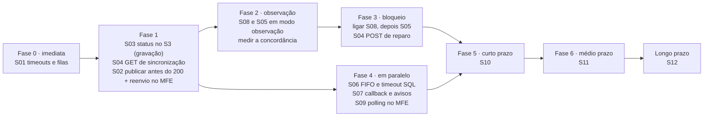

# PRD de Arquitetura — Consistência entre Cadastro e Contratação na Jornada de Consórcio

| Campo | Valor |
|---|---|
| Versão | 1.0 (rascunho para revisão) |
| Data | 21/09/2026 |
| Autoria | Arquitetura de Soluções |
| Base | *Análise arquitetural — Consistência Temporal entre Cadastro de Pessoa e Contratação*, revisão 20 |
| Status | Em revisão com os times Core de Pessoas, Core de Reserva, Contratação, PaaS (Altera Cliente) e MFEs |

> **Convenção:** **[FATO]** foi confirmado pelo time; **[HIPÓTESE]** precisa de validação; **[DECISÃO DE NEGÓCIO]** precisa de um dono de negócio; **[A DEFINIR]** é um parâmetro sem valor acordado.
> Os números de seção entre parênteses (ex.: 6.15) remetem ao documento de análise.

---

## 1. Sumário executivo

**Problema.** A reserva de cotas usa dados cadastrais do **Newcon**, que é atualizado de forma **assíncrona** (de minutos a dias) depois de o HUB Pessoas gravar de forma síncrona no **cadastro único corporativo** e responder 200. A API Contratação pode confirmar a proposta **antes** de o Newcon receber a atualização, e aí **contrata com dados antigos, sem nenhum erro visível**.

**Solução de curtíssimo prazo:**
- **Status de sincronização por pessoa num bucket S3**, aprovado pela governança **[FATO]**, alimentado pelo consumidor do cadastro e pelo callback da Altera Cliente.
- **O HUB Reserva só chama a Contratação quando o status está sincronizado.**
- **A Contratação compara o cadastro único com o Newcon antes de confirmar**, como rede de proteção obrigatória.
- **Complementos:** ordem garantida por pessoa, publicação antes do 200 e ajuste de timeouts.

**Evolução:**
- **Curto prazo:** mensagem só com o identificador, reparo por leitura e verificação de proposta existente.
- **Médio prazo:** orquestrador da jornada (Step Functions) e CDC do Newcon.
- **Longo prazo:** domínios autônomos, com Saga orquestrada e coreografia na periferia.

**Resultado esperado:** **nenhuma proposta confirmada com dados divergentes do cadastro único**, e as esperas saindo do SQL Server e da Contratação.

---

## 2. Contexto

| Ambiente | Componentes |
|---|---|
| AWS | MFE Cadastro, MFE Reserva, HUB Pessoas, HUB Reserva (API, SQS e consumidor), SQS Cadastro e consumidor, **cadastro único corporativo** (fora do domínio de consórcio), API Gateway |
| PaaS (OpenShift) | API Contratação, API Consulta Cliente, API Altera Cliente, API Confirma Proposta Adesão |
| Windows Server | SQL Server Newcon (procedures, views; CDC disponível, mas inativo) |

- **Comunicação entre ambientes:** AWS → PaaS pelo **Kong**; PaaS → AWS pelo **API Gateway**; os dois com **timeout de 15 s** **[FATO]**.
- **Papéis:**
  - O **HUB Pessoas** é o único integrador entre o cadastro único e o Newcon **[FATO]**.
  - O **cadastro único** é a fonte da verdade do dado cadastral.
  - O **Newcon** é o registro da pessoa no contexto do consórcio, da simulação e da proposta **[FATO]**.

---

## 3. Objetivos e não objetivos

**Objetivos**
- **OBJ-1:** impedir a confirmação de proposta com dados cadastrais desatualizados no Newcon.
- **OBJ-2:** tornar a sincronização cadastro único → Newcon **consultável e observável** por pessoa.
- **OBJ-3:** tirar as esperas da Contratação e do SQL Server.
- **OBJ-4:** detectar e recuperar divergências (escrita dupla, desordem, rejeição por regra de negócio).
- **OBJ-5:** evoluir sem "big bang", com cada etapa reversível por feature flag.

**Não objetivos**
- Alterar o cadastro único corporativo ou fazê-lo conhecer o Newcon **[FATO: proibido]**.
- Criar banco de dados (DynamoDB, RDS, cache) no curtíssimo prazo **[FATO: restrição]**.
- Reservar ou bloquear a cota antes da confirmação: é evolução de longo prazo, com Saga.
- Substituir o Newcon ou as stored procedures do fornecedor.

---

## 4. Premissas e restrições

| # | Premissa / restrição | Tipo |
|---|---|---|
| P1 | A reserva deve usar o Newcon | FATO |
| P2 | Nada de banco novo; bucket S3 sem dados cadastrais aprovado | FATO |
| P3 | A Altera Cliente responde 200 só após o commit; 400 = regra de negócio; 5xx = técnico | FATO |
| P4 | O cadastro único devolve `idPessoa`, os dados gravados e `dataUltimaAlteracao` (precisão de segundos) | FATO |
| P5 | O cadastro único não é alterado por outros canais | FATO |
| P6 | A Contratação já lê o cadastro único e o Newcon antes da Confirma | FATO |
| P7 | O cadastro único e o Newcon gravam os campos exatamente como recebem | FATO |
| P8 | O HUB Reserva é o único chamador da Contratação | FATO |
| P9 | O Newcon casa a pessoa por CPF/CNPJ e tem IDs próprios | FATO |
| P10 | Mudanças no Newcon passam pelo fornecedor | FATO |
| P11 | O S3 suporta escrita condicional por ETag no SDK e na região | HIPÓTESE |
| P12 | A gravação no cadastro único é um upsert idempotente | HIPÓTESE |

---

## 5. Stakeholders e responsabilidades

| Time | Responsabilidade principal |
|---|---|
| **Core de Pessoas** | HUB Pessoas, status no S3, endpoints, fila do cadastro, callback na AWS |
| **Core de Reserva** | HUB Reserva: verificação, backoff, expiração |
| **Contratação** | Rede de proteção (6.9), orçamento de timeout, idempotência |
| **PaaS (Altera Cliente)** | Headers, callback, timeout SQL |
| **MFEs** (Cadastro e Reserva) | Reenvio no 5xx, polling, telas de espera e falha |
| **Plataforma / Rede** | Rotas no Kong e no API Gateway, propagação de trace |
| **Governança / DPO** | Bucket S3, retenção, logs |
| **Negócio** | Janela X, SLO, comunicação ao cliente |
| **Fornecedor Newcon** | CDC, detecção de duplicidade, view de proposta existente |

---

## 6. Glossário

| Termo | Definição |
|---|---|
| **Sincronizado** | O Newcon contém a última gravação feita no cadastro único para a pessoa |
| **`idSolicitacao`** | ULID gerado pelo HUB Pessoas a cada gravação; identifica a versão |
| **Janela X** | Tempo máximo que uma reserva pode aguardar a sincronização antes de expirar **[DECISÃO DE NEGÓCIO]** |
| **SLO de sincronização** | Tempo a partir do qual uma pendência é considerada atrasada **[A DEFINIR]** |
| **Rede de proteção** | A comparação cadastro único × Newcon na Contratação (6.9) |
| **Reparo** | Ressincronização do Newcon a partir do cadastro único (6.10) |

---

## 7. Mapa das soluções

| ID | Solução | Horizonte | Seção da análise | Responsável principal | Esforço relativo |
|---|---|---|---|---|---|
| S01 | Ajuste de timeouts e filas | Curtíssimo (imediato) | 6.5 | Core de Reserva, Contratação | P |
| S02 | Publicação antes do 200 + reenvio no MFE | Curtíssimo | 6.10 | Core de Pessoas, MFEs | P |
| S03 | Status de sincronização no S3 | Curtíssimo | 6.15 | Core de Pessoas | M |
| S04 | Endpoints de sincronização e de reparo | Curtíssimo | 6.16 | Core de Pessoas | M |
| S05 | Verificação no HUB Reserva | Curtíssimo | 6.17 | Core de Reserva | M |
| S06 | Ordem por pessoa | Curtíssimo | 6.18 | Core de Pessoas, PaaS | M |
| S07 | Callback como CDC de aplicação + avisos | Curtíssimo / curto | 6.4, 6.14 | PaaS, Core de Pessoas | M |
| S08 | Rede de proteção na Contratação | Curtíssimo | 6.9 | Contratação | P |
| S09 | Polling e experiência no MFE | Curtíssimo | 6.16, 6.17 | MFEs | P |
| S10 | Mensagem magra, reparo automático e proposta existente | Curto | 6.10, 6.11, 7.1 | Core de Pessoas, Contratação | M |
| S11 | Process Manager e CDC do Newcon | Médio | 8 | Core de Reserva, Core de Pessoas, fornecedor | G |
| S12 | Arquitetura alvo | Longo | 9, 15.7 | Arquitetura e todos os times | G |

*Esforço relativo: P = até 1 sprint de um time; M = 1–2 sprints ou mais de um time; G = trimestre ou dependência externa.*

---

## 8. Requisitos transversais (valem para todas as soluções)

| ID | Requisito |
|---|---|
| RNF-T01 | **Nenhum dado cadastral** em logs, eventos, objetos de status ou métricas; só identificadores (`idPessoa`, `idSolicitacao`, `idReserva`, `correlationId`) |
| RNF-T02 | `correlationId` e `traceparent` propagados por HTTP, pelo Kong, pelo API Gateway e pelos atributos das mensagens SQS |
| RNF-T03 | Toda mudança de comportamento atrás de **feature flag**, com **modo observação** antes do bloqueio |
| RNF-T04 | Criptografia em repouso (SSE-KMS) e em trânsito (TLS) em filas, DLQs e bucket |
| RNF-T05 | Toda fila com DLQ, alarme de profundidade acima de 0 e redrive documentado |
| RNF-T06 | Chamadas entre ambientes respeitam: timeout interno < 15 s do gateway < cliente HTTP < visibility timeout |
| RNF-T07 | Consumidores idempotentes: reprocessar uma mensagem não pode gerar efeito duplicado |
| RNF-T08 | Rollback de cada solução em minutos, desligando a flag, sem migração de dados |

---

## 9. Soluções

### S01 — Ajuste de timeouts e filas

**Objetivo:** eliminar o processamento concorrente da mesma reserva e reduzir a janela de "resultado incerto" na chamada à Contratação.
**Responsáveis:** Core de Reserva (fila e cliente HTTP); Contratação (orçamento interno).
**Escopo:** configuração, sem mudança de fluxo.

| ID | Requisito |
|---|---|
| RF-S01-01 | Visibility timeout da fila de reserva entre 60 e 180 s, acima do tempo total de processamento |
| RF-S01-02 | Cliente HTTP do consumidor do HUB Reserva com ~20 s, acima dos 15 s do Kong |
| RF-S01-03 | Orçamento interno da Contratação ≤ 10–12 s, incluindo a leitura do cadastro único via API Gateway |
| RF-S01-04 | Timeout da Lambda (se aplicável) maior que o cliente HTTP (ex.: 25–30 s) |
| RF-S01-05 | O 504 do Kong é registrado e alertado como "resultado incerto" |

- **Dependências:** saber se o consumidor roda em Lambda ou ECS **[pergunta aberta]**.
- **Riscos:** valores atuais desconhecidos (só os 15 s dos gateways são conhecidos).
- **Métricas de sucesso:** zero processamentos concorrentes da mesma reserva; queda na contagem de 504.
- **Critérios de aceite:**
  - num teste com a Contratação levando 14 s, a mensagem não reaparece durante a execução;
  - o 504 aparece no log com `correlationId`.
- **Rollback:** voltar os valores anteriores.

---

### S02 — Publicação antes do 200 e reenvio no MFE

**Objetivo:** fechar a escrita dupla em que o cadastro único é gravado e o Newcon nunca recebe a atualização.
**Responsáveis:** Core de Pessoas (HUB); MFEs (MFE Cadastro).

| ID | Requisito |
|---|---|
| RF-S02-01 | O HUB Pessoas executa, em ordem: grava no cadastro único → grava `PENDENTE` no S3 (S03) → publica na fila → responde 200 |
| RF-S02-02 | Falha ao gravar o S3 ou ao publicar, depois das retentativas do SDK, resulta em **5xx** |
| RF-S02-03 | A mensagem é montada com os **dados retornados pelo cadastro único**, não com o payload original do MFE |
| RF-S02-04 | O MFE Cadastro trata o 5xx como recuperável e permite **reenviar os mesmos dados** sem redigitar |
| RF-S02-05 | A resposta 200 inclui `idPessoa`, `idSolicitacao` e `dataUltimaAlteracao` |

- **RNF:** acréscimo de latência no 200 de no máximo algumas dezenas de milissegundos (p95).
- **Dependências:** P12 (upsert no cadastro único) **[HIPÓTESE]**; o RF-S02-04 precisa estar em produção antes ou junto com o RF-S02-02.
- **Riscos:** o HUB cair entre o commit no cadastro único e a publicação. Nesse caso, fica um `PENDENTE` sem mensagem, que vira `ATRASADO` e é coberto pelo reparo (S04).
- **Métricas de sucesso:** taxa de 5xx por falha de publicação; zero divergências por mensagem perdida.
- **Critérios de aceite:**
  - com a publicação na fila falhando por injeção de falha, o cliente recebe 5xx, reenvia, e o Newcon é atualizado;
  - nenhum 200 é devolvido sem mensagem publicada.
- **Rollback:** flag que volta à ordem anterior.

---

### S03 — Status de sincronização no S3

**Objetivo:** tornar consultável, por pessoa, se a última gravação do cadastro único já foi aplicada no Newcon.
**Responsável:** Core de Pessoas.

**Modelo:** um objeto por pessoa, `atualizacao-cadastral/{idPessoa}.json`, com os campos:
`idPessoa`, `idSolicitacao` (ULID), `status` (`PENDENTE` | `CONCLUIDA` | `FALHOU`), `versaoCadastroUnico`, `solicitadaEm`, `atualizadaEm`, `motivoFalha` (`{tipo, codigo}`), `reparoSolicitadoEm`, `fonte` e `correlationId`.

| ID | Requisito |
|---|---|
| RF-S03-01 | O HUB grava `PENDENTE` com um novo `idSolicitacao` antes do 200 (sobrescrita incondicional) |
| RF-S03-02 | As transições para `CONCLUIDA` e `FALHOU` só acontecem se o `idSolicitacao` do objeto for o da mensagem processada |
| RF-S03-03 | As transições usam escrita condicional por ETag (`If-Match`); um 412 leva a nova leitura e reavaliação |
| RF-S03-04 | Altera 200 → `CONCLUIDA`; 400 → `FALHOU` (`NEGOCIO`, código); 5xx ou 504 → sem alteração |
| RF-S03-05 | A DLQ do cadastro aciona uma função que marca `FALHOU` (`TECNICO`) |
| RF-S03-06 | Um redrive bem-sucedido pode levar de `FALHOU` (técnico) para `CONCLUIDA` |
| RF-S03-07 | `CONCLUIDA` é final para aquele `idSolicitacao` |

| ID | Requisito não funcional |
|---|---|
| RNF-S03-01 | Bucket privado, com bloqueio de acesso público, SSE-KMS, CloudTrail de dados e ciclo de vida (ex.: 30 dias, acima da janela X) |
| RNF-S03-02 | Escrita só pelas funções do Core de Pessoas; leitura só pelo endpoint (S04) |
| RNF-S03-03 | Sem dados cadastrais no objeto |
| RNF-S03-04 | Notificação de evento do S3 → EventBridge para cada mudança do objeto (alimenta S07) |

- **Dependências:** P11 (escrita condicional) **[HIPÓTESE]**.
- **Riscos:** o status divergir do dado (escrita dupla, desordem); coberto por S06 e S08.
- **Métricas de sucesso:** 100% das gravações com objeto `PENDENTE`; tempo `PENDENTE` → `CONCLUIDA` medido.
- **Critérios de aceite:**
  - duas gravações da mesma pessoa em sequência deixam o objeto com o `idSolicitacao` mais recente;
  - a conclusão da mais antiga não altera o objeto.
- **Rollback:** desligar a gravação (flag). O bucket permanece e se esvazia pelo ciclo de vida.

---

### S04 — Endpoints de sincronização e de reparo

**Objetivo:** expor o status do S03 ao HUB Reserva e aos MFEs, e permitir a ressincronização a partir do cadastro único.
**Responsável:** Core de Pessoas.

**Contrato: `GET /v1/pessoas/{idPessoa}/sincronizacao-newcon`**

| Parâmetro | Onde | Obrigatório | Descrição |
|---|---|---|---|
| `idPessoa` | caminho | Sim | Identificador corporativo |
| `idSolicitacao` | query | Não | Se informado e superado por um mais novo, a resposta traz `substituida: true` |
| `X-Correlation-Id` | header | Sim (rota interna) | Rastreio |

| Objeto no S3 | `situacao` |
|---|---|
| Não existe | `SEM_PENDENCIA` |
| `CONCLUIDA` | `SINCRONIZADO` |
| `PENDENTE`, dentro do SLO | `AGUARDANDO` |
| `PENDENTE`, acima do SLO | `ATRASADO` |
| `FALHOU` por negócio | `FALHOU` |
| `FALHOU` técnico | `ATRASADO` |

**Resposta da rota interna (200):** `idPessoa`, `situacao`, `idSolicitacao`, `substituida`, `solicitadaEm`, `atualizadaEm`, `motivoFalha`, `tentarNovamenteEmSegundos` e `versaoContrato`.
**Rota externa (MFE):** só `situacao`, `tentarNovamenteEmSegundos` e o código de falha traduzido.

**Contrato: `POST /v1/pessoas/{idPessoa}/ressincronizacao`.** Lê o cadastro único, grava um novo `PENDENTE` (novo `idSolicitacao`) e republica. É idempotente dentro da janela de reparo, controlada pelo campo `reparoSolicitadoEm`.

| ID | Requisito |
|---|---|
| RF-S04-01 | O GET não tem efeito colateral e não usa cache |
| RF-S04-02 | `SEM_PENDENCIA` responde 200, não 404 |
| RF-S04-03 | `tentarNovamenteEmSegundos` cresce com a idade (ex.: 10 s, 30 s, 60 s) |
| RF-S04-04 | Na rota externa, o `idPessoa` é derivado da sessão ou validado contra ela |
| RF-S04-05 | O POST de reparo ignora pedidos repetidos dentro da janela de reparo (ex.: 30 min) |
| RNF-S04-01 | GET com p99 de dezenas de milissegundos; os clientes usam timeout de 2 s e no máximo 1 retentativa |
| RNF-S04-02 | Limite de requisições na rota externa, por cliente |
| RNF-S04-03 | IAM do GET só de leitura no bucket |

- **Riscos:** exposição do status de outra pessoa (IDOR); mitigada pelo RF-S04-04.
- **Métricas de sucesso:** latência do GET; distribuição por `situacao`; reparos disparados.
- **Critérios de aceite:**
  - cada estado do objeto gera a `situacao` da tabela;
  - um cliente autenticado não consegue consultar outro `idPessoa`;
  - dois POSTs de reparo seguidos geram uma única republicação.
- **Rollback:** o HUB Reserva e os MFEs desligam as flags que usam o endpoint.

---

### S05 — Verificação no HUB Reserva

**Objetivo:** chamar a Contratação somente quando a pessoa estiver sincronizada, mantendo a espera fora do SQL Server.
**Responsável:** Core de Reserva.

**Comportamento:** a mensagem da reserva espera na própria fila. Em `AGUARDANDO`, o consumidor chama `ChangeMessageVisibility` com o atraso sugerido e não apaga a mensagem.

| Situação / resultado | Ação |
|---|---|
| Idade da mensagem maior que a janela X | Reserva `EXPIRADA`, aviso ao cliente, mensagem apagada, alerta |
| `SINCRONIZADO` ou `SEM_PENDENCIA` | Chama a Contratação |
| `AGUARDANDO` | Adia a mensagem (`tentarNovamenteEmSegundos` + jitter); reserva `AGUARDANDO_CADASTRO` |
| `ATRASADO` | POST de reparo (S04) e chamada à Contratação (S08 decide) |
| `FALHOU` | Reserva `FALHOU_CADASTRO`, aviso ao cliente, mensagem apagada |
| Erro ou timeout do endpoint | Chama a Contratação (S08 decide) e alerta |
| Contratação 200 | Sucesso, mensagem apagada |
| Contratação 409 | Adia. Se o endpoint tinha dito `SINCRONIZADO`: reparo + alerta |
| Contratação 504 | Resultado incerto: registrar, alertar, deixar reprocessar |

| ID | Requisito |
|---|---|
| RF-S05-01 | A mensagem da reserva carrega o `idPessoa` corporativo validado **[HIPÓTESE: confirmar se já carrega]** |
| RF-S05-02 | Expiração calculada pelo `SentTimestamp` da mensagem, sem estado adicional |
| RF-S05-03 | Situações `AGUARDANDO_CADASTRO`, `FALHOU_CADASTRO` e `EXPIRADA` visíveis ao polling do MFE **[depende de como o status da reserva é exposto hoje]** |
| RF-S05-04 | Flags independentes: verificação ligada/desligada e modo observação |
| RF-S05-05 | Teto do backoff configurável (ex.: 60 s nos primeiros 30 min; 5 min depois) |
| RNF-S05-01 | `maxReceiveCount` e retenção compatíveis com a janela X; a expiração por idade vence antes da DLQ |
| RNF-S05-02 | Configuração externa para SLO, janela X, teto do backoff e URL e timeout do endpoint |

- **Dependências:** S04; S01; S08 como rede de proteção.
- **Riscos:**
  - cada espera conta como recebimento no SQS: dimensionar o `maxReceiveCount`;
  - latência de até um intervalo de backoff depois da sincronização.
- **Métricas de sucesso:**
  - tempo médio em `AGUARDANDO_CADASTRO`;
  - **taxa de 409 depois de `SINCRONIZADO` ≈ 0**;
  - chamadas à Contratação durante a espera = 0.
- **Critérios de aceite:**
  - com o status `PENDENTE`, a Contratação não é chamada;
  - quando o status vira `CONCLUIDA`, a reserva é processada em até um intervalo de backoff;
  - no modo observação, o fluxo atual não muda.
- **Rollback:** desligar a flag de verificação.

---

### S06 — Ordem por pessoa

**Objetivo:** impedir que uma gravação antiga sobrescreva uma mais nova no Newcon (ex.: duas atualizações com 30 s de diferença).
**Responsáveis:** Core de Pessoas (fila e consumidor); PaaS (timeout SQL).

| ID | Requisito |
|---|---|
| RF-S06-01 | Fila do cadastro **FIFO**, com `MessageGroupId = idPessoa` e `MessageDeduplicationId = idSolicitacao` |
| RF-S06-02 | Timeout de comando SQL na Altera Cliente menor que o Kong (ex.: 10–12 s) |
| RF-S06-03 | Visibility timeout da fila do cadastro entre 60 e 120 s |
| RF-S06-04 | Depois do 200 da Altera, o consumidor relê a `dataUltimaAlteracao` do cadastro único e **não marca `CONCLUIDA`** se ela for mais nova que a versão aplicada |
| RF-S06-05 | 409 depois de `SINCRONIZADO` dispara o reparo (S04/S05), que grava um novo `PENDENTE` |

- **Dependências:** volume de pico **[pergunta aberta]**; migração de Standard para FIFO (fila nova, filas em paralelo durante a transição).
- **Riscos:** throughput da FIFO; mensagem de uma pessoa travando o grupo até ir para a DLQ (comportamento correto, mas precisa de alarme).
- **Métricas de sucesso:** zero regressões detectadas pela 6.9 depois de `SINCRONIZADO`.
- **Critérios de aceite:**
  - com S1 em timeout e S2 enviada 30 s depois, o Newcon termina com S2 e o status com `CONCLUIDA (S2)`;
  - uma consulta durante o processo nunca retorna `SINCRONIZADO` com S1 no Newcon.
- **Rollback:** voltar para a fila Standard (mantida em paralelo durante a transição).

---

### S07 — Callback da Altera como CDC de aplicação, e avisos

**Objetivo:** confirmar a gravação mesmo quando o consumidor perde a resposta da Altera, e avisar o cliente sobre a conclusão ou a rejeição.
**Responsáveis:** PaaS (Altera); Core de Pessoas (recepção e avisos).

**Fluxo:** a Altera, após o commit, envia `POST` ao API Gateway, que aciona a Lambda de validação, a SQS e a Lambda que atualiza o status (S03). A notificação de evento do S3 alimenta o EventBridge, que aciona o aviso ao cliente e as métricas.

**Contrato do callback:** `idSolicitacao`, `idPessoa`, `versaoCadastroUnico`, `resultado` (`CONCLUIDA` | `FALHA_DEFINITIVA`), `codigoErro`, `ocorridoEm` e `correlationId`.

| ID | Requisito |
|---|---|
| RF-S07-01 | A Altera recebe `X-Id-Solicitacao`, `X-Versao-Cadastro` e `X-Correlation-Id` repassados pelo Kong **[FATO: viável]** e os devolve no callback |
| RF-S07-02 | O callback é enviado só após o commit, com timeout curto e poucas retentativas; uma falha no callback não altera a resposta ao consumidor |
| RF-S07-03 | 400 gera `FALHA_DEFINITIVA`; 5xx não gera callback de falha |
| RF-S07-04 | A atualização do status segue as mesmas regras do S03 (idempotente com o consumidor) |
| RF-S07-05 | O evento publicado (`AtualizacaoCadastralAplicadaNoNewcon`) usa o contrato que a ponte do CDC adotará depois |
| RF-S07-06 | Aviso ao cliente em `CONCLUIDA` depois de o tempo de tela expirar, e em `FALHOU` (negócio) |
| RNF-S07-01 | Rota do callback exclusiva para a Altera (mTLS ou OAuth client credentials), com limite de requisições |
| RNF-S07-02 | O payload contém só IDs, códigos e datas |

- **Dependências:** serviço de notificação corporativo **[pergunta aberta]**; S03.
- **Riscos:** o callback sozinho não é trava (um evento não é consultável depois); quem trava é o status do S03.
- **Métricas de sucesso:**
  - % de conclusões confirmadas pelo callback;
  - tempo de sincronização medido do commit no cadastro único até o commit no Newcon;
  - avisos enviados.
- **Critérios de aceite:**
  - com o consumidor recebendo 504 e a gravação concluindo depois, o status vira `CONCLUIDA` pelo callback;
  - um 400 gera aviso ao cliente em até N minutos **[A DEFINIR]**.
- **Rollback:** desligar o envio do callback na Altera (flag); o consumidor continua atualizando o status.

---

### S08 — Rede de proteção na Contratação

**Objetivo:** garantir que a Confirma só aconteça com o Newcon igual ao cadastro único, cobrindo o que o status não pega (escrita dupla, desordem, perda de status).
**Responsável:** Contratação.

| ID | Requisito |
|---|---|
| RF-S08-01 | Depois de ler o cadastro único e a Consulta Cliente, e antes da Confirma, comparar os campos relevantes conforme a **especificação de comparação** versionada |
| RF-S08-02 | Divergência, ou pessoa ausente no Newcon, resulta em `409 CADASTRO_NAO_CONVERGIU`, sem confirmar |
| RF-S08-03 | Modo observação: registrar igual / diferente e os **nomes** dos campos divergentes, nunca os valores |
| RF-S08-04 | A chave que a Contratação usa para ler o cadastro único é a atual **[HIPÓTESE: `idPessoa` ou CPF/CNPJ]** |
| RNF-S08-01 | Sem nova chamada externa; só processamento local |

- **Dependências:** especificação de comparação acordada entre o Core de Pessoas e a Contratação.
- **Riscos:** erro de mapeamento gerando falso "não sincronizou"; mitigado pelo modo observação.
- **Métricas de sucesso:**
  - taxa de "igual" ≈ 100% para pessoas cuja `dataUltimaAlteracao` é mais antiga que o SLO;
  - **zero propostas com divergência**.
- **Critério para ligar o bloqueio:** a taxa acima estável por N dias **[A DEFINIR]**.
- **Rollback:** desligar a flag do bloqueio.

---

### S09 — Polling e experiência no MFE

**Objetivo:** comunicar o estado da sincronização ao cliente sem sobrecarregar o SQL Server.
**Responsável:** MFEs.

| ID | Requisito |
|---|---|
| RF-S09-01 | O MFE Reserva faz polling na rota externa do S04, seguindo `tentarNovamenteEmSegundos` |
| RF-S09-02 | O polling para quando a aba fica oculta e depois de um tempo máximo de tela (ex.: 2–3 min) |
| RF-S09-03 | Telas: "confirmando seu cadastro", "avisaremos você", "precisamos corrigir um dado" (`FALHOU`) e "reserva expirada" |
| RF-S09-04 | Retorno à jornada pelo link do aviso (S07) |
| RF-S09-05 | `correlationId` gerado na intenção de compra e propagado |

- **Riscos:** o polling não é barreira; a garantia está em S05 e S08.
- **Métricas de sucesso:** abandono durante a espera; retorno pelo link do aviso.
- **Critérios de aceite:** o botão de reservar só é habilitado com `SINCRONIZADO` ou `SEM_PENDENCIA`.

---

### S10 — Curto prazo: mensagem magra, reparo automático e proposta existente

**Objetivo:** tornar a ordem irrelevante, recuperar divergências automaticamente e proteger contra proposta duplicada.
**Responsáveis:** Core de Pessoas; Contratação.

| ID | Requisito |
|---|---|
| RF-S10-01 | A mensagem da fila do cadastro passa a carregar **só o identificador**; o consumidor lê o estado atual no cadastro único antes de chamar a Altera (6.11) |
| RF-S10-02 | Com o RF-S10-01 ativo, a conferência do RF-S06-04 continua (cobre a janela entre ler e gravar) |
| RF-S10-03 | Antes da Confirma, a Contratação verifica se já existe proposta para **o mesmo cliente, grupo e cota** no Newcon; se existir, devolve o resultado sem reconfirmar (7.1, item 4) |
| RF-S10-04 | O reparo (S04) pode ser disparado por uma varredura periódica dos objetos `PENDENTE` antigos (S3 Inventory) |
| RNF-S10-01 | Não sobram dados pessoais na fila nem na DLQ do cadastro |

- **Dependências:**
  - acesso do consumidor ao cadastro único e cota de leitura acordada com o time corporativo;
  - view ou procedure de "proposta existente", que existe hoje ou será pedida ao fornecedor **[pergunta aberta]**.
- **Riscos:** carga de leitura no cadastro único; a chave de proposta existente pode não identificar a reserva de forma única.
- **Métricas de sucesso:** zero propostas duplicadas; zero divergências persistentes além do SLO.
- **Critérios de aceite:**
  - reprocessar uma mensagem antiga grava o estado atual;
  - reexecutar a Contratação depois de um 504 não cria uma segunda proposta.
- **Rollback:** flags por item.

---

### S11 — Médio prazo: orquestrador da jornada e CDC do Newcon

**Objetivo:** dar um dono explícito ao estado da jornada e confirmar a replicação pelo banco do Newcon.
**Responsáveis:** Core de Reserva (orquestrador); Core de Pessoas e fornecedor (CDC); Plataforma (ponte).

**Escopo:**
- **Step Functions na AWS.** Estados: `VerificarCadastro` → `AguardarCadastro` (laço `Wait` + nova verificação, sem guardar token) → `Contratar` (uma chamada via Kong) → `ResolverIncerteza` → `Expirar`/`Notificar`.
- **CDC do Newcon:** SQL Server → Kafka → ponte no PaaS (dedup, ordem por pessoa, filtro de colunas) → API Gateway → EventBridge. Publica o mesmo evento do S07.

| ID | Requisito |
|---|---|
| RF-S11-01 | A state machine substitui a espera baseada em reentrega de mensagem (S05) |
| RF-S11-02 | A ponte do CDC publica `AtualizacaoCadastralAplicadaNoNewcon` com o contrato do S07 |
| RF-S11-03 | O CDC captura só as colunas necessárias |
| RF-S11-04 | O CDC começa como **reconciliação e detecção de divergência**, e só depois vira fonte do status |
| RNF-S11-01 | Estado gerenciado do Step Functions aprovado pela governança |

- **Dependências:** CDC habilitado pelo fornecedor **[prazo externo]**; decisão de plataforma sobre a ponte.
- **Riscos:** custo por transição de estado; ponte Kafka → API Gateway como componente crítico novo.
- **Métricas de sucesso:** histórico completo por reserva; divergências detectadas pelo CDC.
- **Rollback:** voltar o HUB Reserva para o S05; desligar o consumo do CDC.

---

### S12 — Longo prazo: arquitetura alvo

**Objetivo:** domínios autônomos e evolução sem acoplamento síncrono entre ambientes.

- **Integração de Pessoas (consórcio):** o HUB Pessoas é o único integrador. O cadastro único é a fonte, o Newcon é a réplica, e fica atrás de uma camada anticorrupção.
- **Jornada/Contratação:** Saga orquestrada quando houver passos compensáveis (ex.: bloqueio de cota).
- **Periferia coreografada:** auditoria, CRM, notificações.
- **Ponte de eventos PaaS ↔ AWS como capacidade de plataforma**, com governança de contratos e versionamento.
- **SLOs publicados:** tempo de sincronização e tempo até a contratação.

**Dependências:** decisões de plataforma e rede, organização dos times por domínio e fornecedor.

---

## 10. Plano de entrega

| Fase | Entrega | Critério para avançar |
|---|---|---|
| 0 | S01 | Valores aplicados e verificados em homologação |
| 1 | S03 (gravação), S04 (GET), S02 | 100% das gravações com objeto `PENDENTE`/`CONCLUIDA`; GET dentro do RNF-S04-01; o MFE trata o 5xx |
| 2 | S08 e S05 em observação | Concordância entre `SINCRONIZADO` e "igual" ≈ 100% por N dias **[A DEFINIR]** |
| 3 | Bloqueio do S08, depois do S05; POST de reparo do S04 | Nenhuma contratação com divergência; 409 depois de `SINCRONIZADO` ≈ 0 |
| 4 | S06, S07, S09 | Critérios de aceite de cada solução |
| 5 | S10 | Zero propostas duplicadas; zero divergências persistentes |
| 6 | S11 | CDC habilitado; orquestrador aprovado |

---

## 11. Métricas de sucesso do programa

| KPI | Meta |
|---|---|
| Propostas confirmadas com divergência entre cadastro único e Newcon | **0** |
| Propostas duplicadas | **0** |
| Chamadas à Contratação durante `PENDENTE` (depois da fase 3) | **0** |
| 409 depois de `SINCRONIZADO` | ≈ 0 (cada ocorrência investigada) |
| Tempo de sincronização p95 | Abaixo do SLO **[A DEFINIR]** |
| Reservas expiradas | Monitorar a tendência; meta de negócio **[A DEFINIR]** |
| Idade da mensagem mais antiga na fila do cadastro | Abaixo do SLO |

---

## 12. Riscos do programa

| Risco | Impacto | Mitigação |
|---|---|---|
| Erro de mapeamento na comparação (S08) | Reservas bloqueadas sem motivo | Modo observação; especificação versionada; flag |
| O status divergir do dado | Contratação chamada cedo demais | S08 como rede de proteção; reparo após 409 |
| Throughput da FIFO insuficiente | Fila de cadastro lenta | Validar o pico; alta vazão da FIFO; migração em paralelo |
| Escrita condicional indisponível no S3 | Corrida de milissegundos no status | S08 cobre; confirmar o SDK e a região |
| Dependência do fornecedor (CDC, duplicidade, view) | Atrasos no curto e médio prazo | Pedidos abertos já; o curtíssimo prazo não depende deles |
| Coordenação entre cinco times | Entrega desalinhada | Fases com critérios de avanço; flags independentes |
| Espera longa e perda da cota | Impacto comercial | Janela X e comunicação definidas pelo negócio |

---

## 13. Alternativas descartadas

| Alternativa | Motivo |
|---|---|
| Delay fixo na fila da reserva | Não garante; a espera real vai de minutos a dias |
| Gravação síncrona no Newcon pelo HUB | O SQL Server lento é uma das causas; move a espera para o usuário |
| Status em DynamoDB (6.2) | Restrição de banco; a lógica foi retomada no S3 |
| Token de versão pelo front (6.8) | Plano B; a comparação no S08 é mais simples |
| Data de sincronização no cadastro único | Proibido: o cadastro único não conhece o Newcon |
| A Contratação sincronizar o Newcon na hora (6.12) | Escreveria dados de outro domínio; não cabe nos 15 s |
| Coreografia pura | Não há mensageria AWS → PaaS; ninguém seria dono do tempo |

---

## 14. Questões abertas

| # | Questão | Dono sugerido | Bloqueia |
|---|---|---|---|
| Q1 | Janela X (validade da intenção de compra) e SLO de sincronização | Negócio | S05, S09, S03 (ciclo de vida) |
| Q2 | Volume de pico de atualizações cadastrais por segundo | Core de Pessoas | S06 |
| Q3 | A mensagem da reserva já carrega o `idPessoa` corporativo? | Core de Reserva | S05 |
| Q4 | Como o status da reserva é exposto hoje ao polling do MFE? | Core de Reserva / MFEs | S05, S09 |
| Q5 | O consumidor do HUB Reserva roda em Lambda ou ECS? | Core de Reserva | S01, S05 |
| Q6 | Existe serviço corporativo de notificação (e-mail/push)? | Core de Pessoas | S07 |
| Q7 | O S3 suporta escrita condicional por ETag no SDK e na região? | Core de Pessoas | S03 |
| Q8 | Timeout de comando SQL atual na Altera Cliente | PaaS | S06 |
| Q9 | A gravação no cadastro único é um upsert idempotente? | Time corporativo | S02 |
| Q10 | Existe view ou procedure de "proposta existente" por cliente, grupo e cota? | PaaS / fornecedor | S10 |
| Q11 | Qual chave a Contratação usa para ler o cadastro único? | Contratação | S08 |
| Q12 | Confirmação formal do time da Contratação para o S08 | Contratação | S08 |

---

## 15. Rastreabilidade

| Solução | Seções da análise | Objetivos |
|---|---|---|
| S01 | 6.5 | OBJ-1, OBJ-5 |
| S02 | 6.10 | OBJ-1, OBJ-4 |
| S03 | 6.15 | OBJ-2 |
| S04 | 6.16, 6.10 | OBJ-2, OBJ-4 |
| S05 | 6.17 | OBJ-1, OBJ-3 |
| S06 | 6.18 | OBJ-1, OBJ-4 |
| S07 | 6.4, 6.13, 6.14 | OBJ-2, OBJ-4 |
| S08 | 6.9 | OBJ-1 |
| S09 | 6.16, 6.17 | OBJ-3 |
| S10 | 6.10, 6.11, 7.1 | OBJ-4 |
| S11 | 8 | OBJ-2, OBJ-5 |
| S12 | 9, 15.7 | OBJ-5 |
